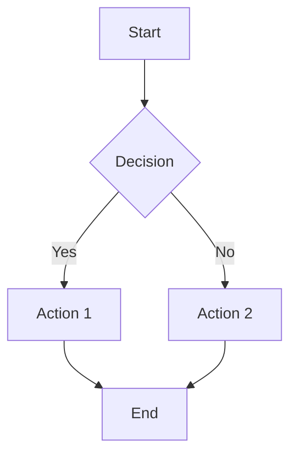

# 团队协作

> 本文档整合了以下源文件：team.md, mattermost.md, collab.md, pad.md, pad2.md, chat.md, jitsi.md, videoconf.md

---

## 来源：team.md

## 简介

Twake 是一款开源团队协作平台，提供消息、文件存储、任务管理和视频会议。它被设计为 Slack 和 Microsoft Teams 的自托管替代方案。

| 特性 | 描述 |
|---------|-------------|
| 消息 | 带频道的实时团队沟通 |
| 文件存储 | 共享文件存储和文档管理 |
| 任务管理 | 内置任务看板和待办列表 |
| 视频通话 | 集成的视频会议 |
| 日历 | 共享日历和活动安排 |

## 架构

### 系统组件

| 组件 | 用途 |
|-----------|---------|
| Twake Backend | 应用逻辑的 API 服务器 |
| Database | MongoDB 或 PostgreSQL 数据存储 |
| Search | Elasticsearch 用于消息和文件搜索 |
| Storage | 文件存储后端（本地或 S3） |
| WebSocket | 实时消息传递 |
| Frontend | 基于 React 的 Web 应用 |

### 沟通模型

| 层级 | 描述 |
|-------|-------------|
| Workspace | 顶层组织容器 |
| Channel | 工作空间内的沟通主题 |
| Thread | 频道内的对话线程 |
| Direct message | 私密的一对一或群组对话 |

## 安装

### Docker 部署

```bash
docker run -d \
  --name=twake \
  -p 8080:8080 \
  -e NODE_ENV=production \
  -e DB_DRIVER=mongodb \
  -e DB_URI=mongodb://db:27017/twake \
  --restart unless-stopped \
  twake/twake:latest
```

### Docker Compose

```yaml
version: "3.8"
services:
  twake:
    image: twake/twake:latest
    container_name: twake
    ports:
      - "8080:8080"
    environment:
      - NODE_ENV=production
      - DB_DRIVER=mongodb
      - DB_URI=mongodb://db:27017/twake
    depends_on:
      - db
      - search
    restart: unless-stopped

  db:
    image: mongo:6
    container_name: twake-mongo
    volumes:
      - mongo_data:/data/db
    restart: unless-stopped

  search:
    image: elasticsearch:8.10.0
    container_name: twake-search
    environment:
      - discovery.type=single-node
      - xpack.security.enabled=false
    volumes:
      - es_data:/usr/share/elasticsearch/data
    restart: unless-stopped

volumes:
  mongo_data:
  es_data:
```

## 工作空间管理

### 创建工作空间

| 步骤 | 操作 |
|------|--------|
| 1 | 点击创建工作空间 |
| 2 | 输入工作空间名称和描述 |
| 3 | 设置工作空间可见性（公开或私密） |
| 4 | 邀请团队成员 |
| 5 | 创建初始频道 |

### 工作空间设置

| 设置 | 描述 |
|---------|-------------|
| 名称 | 工作空间显示名称 |
| 描述 | 工作空间的用途和范围 |
| 可见性 | 公开（可发现）或私密（仅限邀请） |
| 默认频道 | 所有成员自动加入的频道 |
| 权限 | 成员功能和限制 |

### 成员角色

| 角色 | 权限 |
|------|-------------|
| Owner | 完全工作空间控制、计费、成员管理 |
| Admin | 频道管理、成员邀请 |
| Member | 标准频道和功能访问 |
| Guest | 对特定频道的有限访问 |

## 频道

### 频道类型

| 类型 | 描述 | 使用场景 |
|------|-------------|----------|
| Public | 对所有工作空间成员开放 | 一般讨论 |
| Private | 仅限邀请的频道 | 敏感话题 |
| Direct | 一对一对话 | 私密消息 |
| Group DM | 多人私密对话 | 小团队讨论 |

### 频道管理

| 操作 | 描述 |
|--------|-------------|
| 创建 | 设置新频道的名称和用途 |
| 归档 | 关闭频道但保留历史记录 |
| 静音 | 停止频道通知 |
| 置顶 | 将频道添加到收藏 |
| 成员 | 添加或移除频道成员 |

### 频道设置

| 设置 | 描述 |
|---------|-------------|
| 名称 | 频道显示名称 |
| 主题 | 频道主题或用途 |
| 描述 | 详细频道描述 |
| 权限 | 谁可以发帖、邀请和管理 |
| 通知 | 成员的通知偏好 |

## 消息

### 消息功能

| 功能 | 描述 |
|---------|-------------|
| 富文本 | 加粗、斜体、代码和列表格式化 |
| 表情符号 | 对消息的表情反应 |
| 线程 | 回复特定消息的线程 |
| 提及 | @提及用户和频道 |
| 链接 | 自动链接预览 |
| 代码块 | 语法高亮的代码片段 |
| 投票 | 创建和参与投票 |

### 消息格式

| 语法 | 结果 |
|--------|--------|
| `*bold*` | **bold** |
| `_italic_` | _italic_ |
| `~strikethrough~` | ~~strikethrough~~ |
| `` `code` `` | `code` |
| ` ```code block``` ` | 代码块 |
| `> quote` | 引用块 |

### 通知

| 触发器 | 描述 |
|---------|-------------|
| 私信 | 始终通知 |
| @提及 | 被提及时通知 |
| 频道消息 | 根据频道设置通知 |
| 线程回复 | 参与线程时通知 |

## 文件管理

### 文件操作

| 操作 | 描述 |
|-----------|-------------|
| 上传 | 拖放或点击上传 |
| 预览 | 预览图片、文档和代码 |
| 下载 | 下载文件到本地系统 |
| 搜索 | 按名称和内容搜索文件 |
| 分享 | 在频道和消息中分享文件 |

### 支持的文件类型

| 类别 | 格式 |
|----------|---------|
| 文档 | PDF、DOC、DOCX、XLS、XLSX、PPT、PPTX |
| 图片 | JPG、PNG、GIF、SVG、WebP |
| 代码 | JS、PY、HTML、CSS、JSON、MD |
| 压缩包 | ZIP、RAR、TAR、GZ |
| 媒体 | MP4、MP3、WAV、AVI |

### 文件存储

| 设置 | 描述 |
|---------|-------------|
| 存储后端 | 本地文件系统或 S3 兼容存储 |
| 最大文件大小 | 可配置的上传限制 |
| 保留策略 | 文件保留时长 |
| 版本控制 | 跟踪文件版本 |

## 任务管理

### 任务功能

| 功能 | 描述 |
|---------|-------------|
| 任务看板 | 看板式看板组织任务 |
| 任务列表 | 消息中的简单待办列表 |
| 分配 | 将任务分配给团队成员 |
| 截止日期 | 设置任务截止日期 |
| 标签 | 使用标签分类任务 |
| 评论 | 在评论线程中讨论任务 |

### 任务看板结构

| 层级 | 描述 |
|-------|-------------|
| Board | 任务列表的集合 |
| List | 看板中的列（如待办、进行中、已完成） |
| Card | 带详情的单个任务 |
| Checklist | 卡片内的子任务 |

### 任务属性

| 属性 | 描述 |
|----------|-------------|
| Title | 任务名称 |
| Description | 详细任务描述 |
| Assignee | 任务负责人 |
| Due date | 完成截止日期 |
| Priority | 高、中或低优先级 |
| Status | 当前任务状态 |
| Tags | 分类标签 |

## 日历

### 日历功能

| 功能 | 描述 |
|---------|-------------|
| 活动 | 创建和管理日历活动 |
| 邀请 | 邀请团队成员参加活动 |
| 提醒 | 设置活动提醒 |
| 重复活动 | 安排重复活动 |
| 共享日历 | 查看团队成员的可用性 |

### 活动属性

| 属性 | 描述 |
|----------|-------------|
| Title | 活动名称 |
| Date/time | 开始和结束时间 |
| Location | 实体或虚拟会议地点 |
| Description | 活动详情和议程 |
| Attendees | 受邀参与者 |
| Recurrence | 重复模式（每天、每周、每月） |

## 视频会议

### 视频通话功能

| 功能 | 描述 |
|---------|-------------|
| 一对一 | 用户之间的直接视频通话 |
| 群组通话 | 多人视频会议 |
| 屏幕共享 | 与参与者共享屏幕 |
| 聊天 | 视频通话期间的文字聊天 |
| 录制 | 录制会议（如已配置） |

### 通话设置

| 设置 | 描述 |
|---------|-------------|
| Camera | 启用/禁用视频 |
| Microphone | 启用/禁用音频 |
| Background | 虚拟背景选项 |
| Quality | 视频质量设置 |

## 集成

### 内置集成

| 集成 | 描述 |
|-------------|-------------|
| Google Drive | 访问 Google Drive 文件 |
| GitHub | 接收通知和管理 Issues |
| Jira | 同步任务和问题 |
| Calendar | 连接外部日历 |
| Bots | 自定义 Bot 集成 |

### Webhook 集成

| 步骤 | 操作 |
|------|--------|
| 1 | 导航到频道设置 |
| 2 | 选择集成 |
| 3 | 创建入站 Webhook |
| 4 | 复制 Webhook URL |
| 5 | 配置外部服务发送到 Webhook URL |

## 管理

### 用户管理

| 操作 | 描述 |
|--------|-------------|
| 邀请用户 | 发送邮件邀请 |
| 管理角色 | 分配 Admin、Member 或 Guest 角色 |
| 停用 | 禁用用户账户 |
| 重置密码 | 强制密码重置 |

### 系统设置

| 设置 | 描述 |
|---------|-------------|
| 公司名称 | 组织显示名称 |
| 认证 | 登录方式（密码、SSO、LDAP） |
| 存储 | 配置文件存储后端 |
| 邮件 | 通知的 SMTP 设置 |
| 安全 | 密码策略和会话管理 |

## 总结

| 主题 | 核心要点 |
|-------|-------------|
| 用途 | 自托管团队协作平台 |
| 消息 | 频道、线程、私信和富文本格式 |
| 文件 | 上传、预览、搜索和分享文件 |
| 任务 | 看板和任务列表用于项目管理 |
| 日历 | 带活动和提醒的共享日历 |
| 视频 | 内置视频会议，支持屏幕共享 |


---

## 来源：mattermost.md

## 简介

Mattermost 是一个开源、自托管的团队消息平台。它为组织提供安全通信，功能类似于 Slack 和 Microsoft Teams。

### 什么是 Mattermost？

Mattermost 是一个工作场所消息解决方案，提供频道、私信、文件共享和集成功能，同时将数据控制权掌握在自己手中。

| 特性 | 描述 |
|------|------|
| 频道 | 有组织的团队对话 |
| 私信 | 私人对话 |
| 文件共享 | 分享文档和图片 |
| 集成 | 与其他工具连接 |
| 搜索 | 全文消息搜索 |

### 与其他方案的比较

| 特性 | Mattermost | Slack | Teams |
|------|-----------|-------|-------|
| 自托管 | 是 | 否 | 否 |
| 开源 | 是 | 否 | 否 |
| 免费层级 | 是 | 有限 | 有限 |
| 数据控制 | 完全 | 有限 | 有限 |
| 合规 | HIPAA、SOC2 | SOC2 | SOC2 |

## 安装

### 系统要求

| 组件 | 最低 | 推荐 |
|------|------|------|
| CPU | 1 核 | 2+ 核 |
| 内存 | 2 GB | 4+ GB |
| 存储 | 10 GB | 50+ GB |
| 数据库 | PostgreSQL 11+ | PostgreSQL 13+ |

### Docker 安装

```yaml
version: '3'
services:
  mattermost:
    image: mattermost/mattermost-team-edition
    ports:
      - "8065:8065"
    volumes:
      - ./mattermost/config:/mattermost/config
      - ./mattermost/data:/mattermost/data
      - ./mattermost/logs:/mattermost/logs
    environment:
      - MM_SQLSETTINGS_DRIVERNAME=postgres
      - MM_SQLSETTINGS_DATASOURCE=mmuser:password@db:5432/mattermost?sslmode=disable&connect_timeout=10
    depends_on:
      - db

  db:
    image: postgres:13
    environment:
      - POSTGRES_USER=mmuser
      - POSTGRES_PASSWORD=password
      - POSTGRES_DB=mattermost
    volumes:
      - postgres_data:/var/lib/postgresql/data

volumes:
  postgres_data:
```

### 手动安装

```bash
# 下载 Mattermost
wget https://releases.mattermost.com/9.0.0/mattermost-9.0.0-linux-amd64.tar.gz
tar -xzf mattermost-9.0.0-linux-amd64.tar.gz

# 创建用户和目录
sudo useradd -r -U mattermost
sudo mv mattermost /opt/
sudo chown -R mattermost:mattermost /opt/mattermost

# 配置数据库
sudo -u postgres createuser -P mmuser
sudo -u postgres createdb -O mmuser mattermost
```

## 配置

### 基本配置

```json
{
  "ServiceSettings": {
    "SiteURL": "https://mattermost.example.com",
    "ListenAddress": ":8065",
    "EnableSecurityFixAlert": true
  },
  "SqlSettings": {
    "DriverName": "postgres",
    "DataSource": "mmuser:password@localhost:5432/mattermost?sslmode=disable"
  },
  "FileSettings": {
    "Directory": "/opt/mattermost/data/",
    "MaxFileSize": 104857600
  }
}
```

### 环境变量

```env
MM_SQLSETTINGS_DRIVERNAME=postgres
MM_SQLSETTINGS_DATASOURCE=mmuser:password@localhost:5432/mattermost
MM_SERVICESETTINGS_SITEURL=https://mattermost.example.com
```

### 系统控制台设置

| 类别 | 设置 |
|------|------|
| 常规 | 站点名称、描述 |
| 认证 | 登录方式、安全 |
| 通知 | 邮件、推送通知 |
| 集成 | Webhook、Bot |
| 合规 | 数据保留、导出 |

## 频道

### 频道类型

| 类型 | 描述 | 可见性 |
|------|------|--------|
| Public | 对所有团队成员开放 | 所有人可见 |
| Private | 仅邀请频道 | 非成员不可见 |
| Direct | 一对一对话 | 私密 |
| Group | 小组对话 | 私密 |

### 频道管理

| 操作 | 描述 |
|------|------|
| 创建 | 创建新频道 |
| 归档 | 停用频道 |
| 静音 | 停止通知 |
| 收藏 | 固定到侧边栏 |
| 标记已读 | 清除未读状态 |

### 频道设置

| 设置 | 描述 |
|------|------|
| 头部 | 频道主题/描述 |
| 用途 | 频道用途 |
| 权限 | 谁可以发帖、管理 |
| 通知 | 通知偏好 |

## 消息

### 消息格式

| 语法 | 结果 |
|------|------|
| `**bold**` | **bold** |
| `*italic*` | *italic* |
| `~~strike~~` | ~~strike~~ |
| `` `code` `` | `code` |
| ```code block``` | 代码块 |

### 消息功能

| 功能 | 描述 |
|------|------|
| @mentions | 通知特定用户 |
| @channel | 通知所有频道成员 |
| @here | 通知在线成员 |
| Emoji | 反应表情 |
| 线程 | 线程回复 |
| 置顶 | 置顶重要消息 |

### 命令

| 命令 | 描述 |
|------|------|
| `/away` | 设置状态为离开 |
| `/online` | 设置状态为在线 |
| `/dnd` | 请勿打扰 |
| `/code` | 格式化为代码 |
| `/help` | 显示帮助 |

## 用户管理

### 用户角色

| 角色 | 权限 |
|------|------|
| System Admin | 完全系统访问 |
| Team Admin | 管理团队设置 |
| Channel Admin | 管理频道设置 |
| Member | 基本消息 |
| Guest | 有限访问 |

### 团队管理

| 操作 | 描述 |
|------|------|
| 创建团队 | 新团队工作区 |
| 邀请用户 | 发送邀请 |
| 管理成员 | 添加/移除用户 |
| 团队设置 | 配置团队 |

### 用户设置

| 设置 | 描述 |
|------|------|
| 个人资料 | 姓名、头像、状态 |
| 通知 | 邮件、推送、桌面 |
| 显示 | 主题、语言 |
| 安全 | 密码、2FA |
| 高级 | 性能设置 |

## 集成

### Webhook

#### 传入 Webhook

```json
POST /hooks/webhook-id
{
  "text": "Build completed successfully",
  "username": "CI/CD",
  "icon_emoji": ":rocket:"
}
```

#### 传出 Webhook

```json
{
  "trigger_words": ["build", "deploy"],
  "url": "https://ci.example.com/webhook",
  "channel": "dev-ops"
}
```

### Bot 账户

| 功能 | 描述 |
|------|------|
| API 令牌 | 编程访问 |
| 自定义帖子 | 富消息格式 |
| 集成 | 连接外部服务 |

### 斜杠命令

```json
{
  "trigger": "/deploy",
  "url": "https://deploy.example.com/command",
  "method": "POST"
}
```

### 热门集成

| 集成 | 用途 |
|------|------|
| GitHub | 代码通知 |
| Jira | 问题跟踪 |
| Jenkins | CI/CD 通知 |
| GitLab | 代码管理 |
| Zapier | 工作流自动化 |

## API 访问

### REST API

| 端点 | 方法 | 描述 |
|------|------|------|
| `/api/v4/users` | GET | 列出用户 |
| `/api/v4/channels` | GET | 列出频道 |
| `/api/v4/posts` | GET | 列出帖子 |
| `/api/v4/posts` | POST | 创建帖子 |

### 身份验证

```bash
# 登录并获取令牌
curl -X POST https://mattermost.example.com/api/v4/users/login \
  -d '{"login_id":"user","password":"pass"}' \
  -H "Content-Type: application/json"
```

### WebSocket API

```javascript
const ws = new WebSocket('wss://mattermost.example.com/api/v4/websocket');
ws.onmessage = function(event) {
  const data = JSON.parse(event.data);
  console.log(data);
};
```

## 安全

### 认证方式

| 方式 | 描述 |
|------|------|
| 邮箱/密码 | 基本认证 |
| LDAP/AD | 目录集成 |
| SAML | 单点登录 |
| OAuth 2.0 | 外部提供者 |
| MFA | 双因素认证 |

### 安全设置

| 设置 | 描述 |
|------|------|
| 密码策略 | 最低要求 |
| 会话管理 | 超时、限制 |
| IP 过滤 | 允许/拒绝 IP |
| 加密 | TLS、静态加密 |

### 合规

| 功能 | 描述 |
|------|------|
| 数据保留 | 自动删除消息 |
| 合规导出 | 用于审计的导出 |
| 审计日志 | 跟踪用户操作 |
| eDiscovery | 搜索和导出 |

## 高可用性

### 集群配置

```json
{
  "ClusterSettings": {
    "Enable": true,
    "ClusterName": "production",
    "InterNodeListenAddress": ":8075",
    "InterNodeUrls": ["http://node1:8075", "http://node2:8075"]
  }
}
```

### 负载均衡

| 组件 | 策略 |
|------|------|
| 应用 | 轮询 |
| 数据库 | 主从 |
| 文件存储 | 共享存储 |
| 会话 | 会话粘性 |

## 备份和恢复

### 备份方式

| 方式 | 描述 |
|------|------|
| 数据库导出 | PostgreSQL 备份 |
| 文件备份 | 数据目录备份 |
| 配置备份 | 配置文件 |

### 备份脚本

```bash
#!/bin/bash
# 数据库备份
pg_dump -U mmuser mattermost > backup_$(date +%Y%m%d).sql

# 文件备份
tar -czf mattermost_files_$(date +%Y%m%d).tar.gz /opt/mattermost/data/
```

## 监控

### 指标

| 指标 | 描述 |
|------|------|
| 活跃用户 | 当前连接数 |
| 每日帖子 | 消息量 |
| 频道数量 | 频道数 |
| 文件存储 | 存储使用 |

### 健康检查

```bash
curl https://mattermost.example.com/api/v4/system/ping
```

## 总结

| 功能 | 用途 |
|------|------|
| 频道 | 有组织的对话 |
| 集成 | 连接外部工具 |
| API | 编程访问 |
| 安全 | 企业级安全 |
| 自托管 | 完全数据控制 |


---

## 来源：collab.md

## 简介

CryptPad 是一个开源的端到端加密协作编辑平台。它提供实时文档编辑、电子表格、演示文稿和其他生产力工具，同时确保服务器永远无法访问未加密的内容。本教程涵盖设置、功能和用法。

## 架构

| 组件 | 技术 | 用途 |
|------|------|------|
| 后端 | Node.js | API 和 WebSocket 服务器 |
| 数据库 | MongoDB/SQLite | 元数据存储 |
| 存储 | 基于文件 | 加密文档存储 |
| 前端 | JavaScript | 协作编辑 UI |
| 加密 | NaCl | 端到端加密 |

## 安装

### Docker Compose

```yaml
version: "3"
services:
  cryptpad:
    image: cryptpad/cryptpad:latest
    ports:
      - "3000:3000"
      - "3001:3001"
    volumes:
      - cryptpad_data:/cryptpad/data
      - cryptpad_blob:/cryptpad/blob
      - cryptpad_block:/cryptpad/block
    environment:
      - CPAD_MAIN_DOMAIN=https://cryptpad.example.com
      - CPAD_CONF=/cryptpad/config/config.js
    restart: unless-stopped
volumes:
  cryptpad_data:
  cryptpad_blob:
  cryptpad_block:
```

### Docker Run

```bash
docker run -d \
  -p 3000:3000 \
  -p 3001:3001 \
  -v cryptpad_data:/cryptpad/data \
  -v cryptpad_blob:/cryptpad/blob \
  -e CPAD_MAIN_DOMAIN=https://cryptpad.example.com \
  cryptpad/cryptpad:latest
```

## 文档类型

### 可用应用

| 应用 | 描述 | 文件扩展名 |
|------|------|-----------|
| Rich Text | 协作文档编辑器 | .doc |
| Spreadsheet | 协作电子表格 | .sheet |
| Presentation | 幻灯片编辑器 | .slides |
| Kanban | 任务管理看板 | .board |
| Form | 数据收集表单 | .form |
| Code | 语法高亮编辑器 | .code |
| Diagram | 流程图和图表工具 | .draw |
| Markdown | Markdown 编辑器 | .md |
| Poll | 日程投票 | .poll |
| Whiteboard | 协作绘画 | .whiteboard |
| File Upload | 加密文件存储 | 各种 |

## 端到端加密

### 工作原理

| 步骤 | 描述 |
|------|------|
| 1 | 用户创建或打开文档 |
| 2 | 加密密钥在浏览器中生成 |
| 3 | 密钥嵌入 URL 中（# 之后） |
| 4 | 内容在发送到服务器前加密 |
| 5 | 服务器仅存储加密的 blob |
| 6 | 其他用户使用 URL 中的密钥解密 |

### 密钥结构

```
https://cryptpad.example.com/doc/#/2/edit/
  <channel_key>/
  <key>/
  <version>
```

`#` 之后的密钥永远不会发送到服务器。只有拥有完整 URL 的用户才能解密内容。

### 安全属性

| 属性 | 描述 |
|------|------|
| 零知识 | 服务器无法读取内容 |
| 密钥在 URL 中 | 密钥从不传输到服务器 |
| 客户端加密 | 加密/解密在浏览器中进行 |
| 无密钥托管 | 密钥丢失无法恢复 |

## 协作功能

### 实时协作

| 功能 | 描述 |
|------|------|
| 在线状态 | 查看谁在线 |
| 光标跟踪 | 查看协作者的光标 |
| 即时同步 | 更改实时出现 |
| 冲突解决 | 自动合并同时编辑 |
| 聊天 | 每个文档内置聊天 |

### 共享选项

| 方法 | 描述 | 安全性 |
|------|------|--------|
| 仅查看 | 只读访问 | 带查看密钥的链接 |
| 编辑访问 | 完全编辑权限 | 带编辑密钥的链接 |
| 嵌入 | 嵌入其他页面 | 仅查看 iframe |
| 密码保护 | 附加访问控制 | 链接加密码 |

## 用户账户

### 账户功能

| 功能 | 访客 | 注册用户 |
|------|------|----------|
| 创建文档 | 是 | 是 |
| 持久存储 | 否（基于会话） | 是 |
| 云盘组织 | 否 | 是 |
| 存储配额 | 有限 | 可配置 |
| 团队功能 | 否 | 是 |
| 个人资料 | 否 | 是 |

### 注册

1. 导航到 CryptPad 实例。
2. 点击"Sign Up"。
3. 输入用户名和密码。
4. 完成注册。

注意：密码无法恢复。没有密码重置功能。

## 云盘组织

### 云盘结构

```
My Drive/
  Documents/
    Meeting Notes.doc
    Project Plan.sheet
  Media/
    Photos/
    Files/
  Shared with Me/
    Team Docs/
    Client Files/
  Trash/
```

### 组织功能

| 功能 | 描述 |
|------|------|
| 文件夹 | 创建嵌套文件夹结构 |
| 标签 | 添加彩色标签 |
| 模板 | 保存文档模板 |
| 回收站 | 恢复已删除文档 |
| 搜索 | 跨云盘全文搜索 |

## 团队

### 团队功能

| 功能 | 描述 |
|------|------|
| 共享云盘 | 团队可访问的文档空间 |
| 成员 | 邀请团队成员 |
| 角色 | Owner、admin、member |
| 聊天 | 团队范围通信 |
| 置顶 | 置顶重要文档 |

### 创建团队

1. 导航到侧边栏中的 Teams。
2. 点击"Create a Team"。
3. 设置团队名称和头像。
4. 通过用户名邀请成员。
5. 将文档添加到团队云盘。

## 表单

### 创建表单

| 字段类型 | 描述 |
|----------|------|
| Text Input | 单行文本 |
| Text Area | 多行文本 |
| Radio | 单选 |
| Checkbox | 多选 |
| Dropdown | 选择菜单 |
| Date | 日期选择器 |
| Email | 邮箱输入 |
| Number | 数字输入 |
| Scale | 评分量表 |

### 表单设置

| 设置 | 描述 |
|------|------|
| 匿名回复 | 无用户跟踪 |
| 每人一次 | 限制一次提交 |
| 截止日期 | 日期后自动关闭 |
| 通知 | 新回复时发邮件 |

## 管理

### 管理面板

访问 `/admin` 的管理面板。

| 部分 | 描述 |
|------|------|
| General | 实例设置 |
| User Management | 管理注册用户 |
| Storage | 监控存储使用 |
| Network | 性能设置 |
| Security | 访问控制 |
| Customize | 品牌和外观 |

### 实例配置

```javascript
// config/config.js
module.exports = {
    httpAddress: '0.0.0.0',
    httpPort: 3000,
    httpUnsafeOrigin: 'https://cryptpad.example.com',
    httpSafeOrigin: 'https://cryptpad-csp.example.com',
    adminKeys: ['your-admin-public-key'],
    defaultStorageLimit: 100 * 1024 * 1024, // 100MB
    maxUploadSize: 50 * 1024 * 1024, // 50MB
};
```

### 存储限制

| 用户类型 | 默认限制 | 可配置 |
|----------|----------|--------|
| 访客 | 5 MB | 是 |
| 注册用户 | 50 MB | 是 |
| 高级用户 | 1 GB+ | 是 |
| 管理员 | 无限 | 不适用 |

## API 访问

### REST API

```bash
# 获取文档信息
curl https://cryptpad.example.com/api/document?channel=CHANNEL_ID

# 获取存储配额
curl -H "Authorization: Bearer TOKEN" \
  https://cryptpad.example.com/api/quota
```

## 备份

### 备份组件

| 组件 | 位置 | 方法 |
|------|------|------|
| 文档 | `/cryptpad/blob/` | 文件复制 |
| 元数据 | `/cryptpad/data/` | 文件复制 |
| 数据库 | MongoDB 导出 | mongodump |
| 配置 | `/cryptpad/config/` | 文件复制 |

### 备份脚本

```bash
#!/bin/bash
BACKUP_DIR="/backups/cryptpad/$(date +%Y%m%d)"
mkdir -p "$BACKUP_DIR"

# 备份数据
docker cp cryptpad:/cryptpad/data "$BACKUP_DIR/data"
docker cp cryptpad:/cryptpad/blob "$BACKUP_DIR/blob"
docker cp cryptpad:/cryptpad/block "$BACKUP_DIR/block"

# 备份配置
docker cp cryptpad:/cryptpad/config "$BACKUP_DIR/config"

# 清理旧备份
find /backups/cryptpad -maxdepth 1 -mtime +30 -exec rm -rf {} \;
```

## 反向代理

### Nginx 配置

```nginx
server {
    listen 443 ssl;
    server_name cryptpad.example.com;

    ssl_certificate /etc/letsencrypt/live/cryptpad.example.com/fullchain.pem;
    ssl_certificate_key /etc/letsencrypt/live/cryptpad.example.com/privkey.pem;

    location / {
        proxy_pass http://localhost:3000;
        proxy_set_header Host $host;
        proxy_set_header X-Real-IP $remote_addr;
        proxy_set_header X-Forwarded-For $proxy_add_x_forwarded_for;
        proxy_set_header X-Forwarded-Proto $scheme;
        proxy_http_version 1.1;
        proxy_set_header Upgrade $http_upgrade;
        proxy_set_header Connection "upgrade";
    }
}
```

## 自定义

### 品牌

| 设置 | 描述 |
|------|------|
| 实例名称 | 显示名称 |
| Logo | 自定义 logo 图片 |
| 配色方案 | 主色和强调色 |
| 页脚 | 自定义页脚文本 |
| 隐私政策 | 自定义隐私页面 |
| 服务条款 | 自定义条款页面 |

## 移动支持

### 响应式设计

CryptPad 的 Web 界面是响应式的，可在移动浏览器上工作。

| 功能 | 移动支持 |
|------|----------|
| 文档编辑 | 是 |
| 电子表格编辑 | 是 |
| 演示文稿查看 | 是 |
| 文件管理 | 是 |
| 实时协作 | 是 |

## 限制

| 限制 | 描述 |
|------|------|
| 无密码恢复 | 密码丢失意味着数据丢失 |
| 无离线编辑 | 需要活动连接 |
| 文件大小限制 | 可配置的上传限制 |
| 搜索限制 | 仅客户端搜索 |

## 总结

CryptPad 提供端到端加密的协作编辑，具有零知识架构。服务器永远看不到未加密的内容，因为所有加密都在浏览器中进行。它支持文档、电子表格、演示文稿、表单和其他生产力工具。使用 Docker 部署，作为商业协作平台的隐私保护替代方案。


---

## 来源：pad.md

## 简介

Etherpad 是一个高度可定制的开源在线编辑器，支持实时协作文档编辑。多个用户可以同时编辑同一文档，带有实时光标、变更追踪和内置聊天功能。

## 系统要求

| 组件 | 最低配置 | 推荐配置 |
|------|---------|---------|
| Node.js | 18.0 | 20 LTS |
| 内存 | 512 MB | 2 GB |
| CPU | 1 核 | 2 核 |
| 磁盘 | 1 GB | 10 GB |
| 数据库 | DirtyDB（内置） | PostgreSQL 或 MySQL |

## 安装

### 使用 Git 和 npm

```bash
git clone https://github.com/ether/etherpad-lite.git
cd etherpad-lite
bin/run.sh
```

### Docker 安装

```bash
docker pull etherpad/etherpad:latest
docker run -d \
  --name etherpad \
  -p 9001:9001 \
  -e ADMIN_PASSWORD=admin123 \
  etherpad/etherpad:latest
```

### Docker Compose 搭配 PostgreSQL

```yaml
version: '3.8'
services:
  etherpad:
    image: etherpad/etherpad:latest
    ports:
      - "9001:9001"
    environment:
      - ADMIN_PASSWORD=admin123
      - DB_TYPE=postgres
      - DB_HOST=db
      - DB_PORT=5432
      - DB_USER=etherpad
      - DB_PASS=etherpad
      - DB_NAME=etherpad
    depends_on:
      - db
    restart: unless-stopped

  db:
    image: postgres:15
    volumes:
      - pg-data:/var/lib/postgresql/data
    environment:
      - POSTGRES_USER=etherpad
      - POSTGRES_PASSWORD=etherpad
      - POSTGRES_DB=etherpad
    restart: unless-stopped

volumes:
  pg-data:
```

## 配置

### settings.json 关键选项

```json
{
  "title": "My Etherpad Instance",
  "favicon": "favicon.ico",
  "ip": "0.0.0.0",
  "port": 9001,
  "showSettingsInAdminPage": true,
  "dbType": "dirty",
  "dbSettings": {
    "filename": "var/dirty.db"
  },
  "defaultPadText": "Welcome to Etherpad!\n\n",
  "padOptions": {
    "noColors": false,
    "showControls": true,
    "showChat": true,
    "showLineNumbers": true,
    "useMonospaceFont": false
  }
}
```

### 数据库选项

| 数据库 | 模块 | 用途 |
|--------|------|------|
| DirtyDB | 内置 | 开发和测试 |
| PostgreSQL | ueberDB2 | 生产部署 |
| MySQL | ueberDB2 | 生产部署 |
| MongoDB | ueberDB2 | 生产部署 |
| SQLite | ueberDB2 | 小型部署 |

## 认证

### 管理员认证方式

| 方式 | 配置 | 用途 |
|------|------|------|
| Basic Auth | `ADMIN_USER` / `ADMIN_PASSWORD` 环境变量 | 简单管理访问 |
| LDAP | `ep_ldapauth` 插件 | 企业目录 |
| OAuth | 各种认证插件 | 单点登录 |
| API Key | 配置中的 `APIKEY` 设置 | 编程访问 |

### 用户认证插件

| 插件 | 协议 | 功能 |
|------|------|------|
| ep_auth_session | 基于会话 | 简单用户管理 |
| ep_ldapauth | LDAP / Active Directory | 目录集成 |
| ep_oauth2 | OAuth 2.0 | SSO 支持 |
| ep_saml | SAML 2.0 | 企业单点登录 |

## Pad 管理

### Pad URL 操作

| 操作 | URL 格式 | 说明 |
|------|---------|------|
| 创建新 pad | `/p/padname` | 首次访问时自动创建 |
| 只读视图 | `/p/padname?showChat=false` | 只读访问 |
| 导出 pad | `/p/padname/export/{format}` | 以各种格式下载 |
| 导入到 pad | `/p/padname/import` | 上传文档到 pad |
| 查看历史 | `/p/padname/timeslider` | 版本历史查看器 |

### 导出格式

| 格式 | 扩展名 | 说明 |
|------|--------|------|
| 纯文本 | `.txt` | 基本文本内容 |
| PDF | `.pdf` | 格式化文档 |
| OpenDocument | `.odt` | 兼容 LibreOffice |
| HTML | `.html` | Web 可用格式 |
| Markdown | `.md` | Markdown 语法 |
| DokuWiki | `.txt` | Wiki 标记 |

## 插件系统

### 基础插件

| 插件 | 用途 | 分类 |
|------|------|------|
| ep_adminpads2 | 从管理面板管理所有 pad | 管理 |
| ep_delete_pad | 从 UI 删除 pad | 管理 |
| ep_headings2 | 标题支持（H1-H6） | 格式 |
| ep_markdown | Markdown 导入和导出 | 格式 |
| ep_tables2 | 表格创建和编辑 | 格式 |
| ep_image_upload | 在 pad 中嵌入图片 | 媒体 |
| ep_comments | 行内评论 | 协作 |
| ep_align | 文本对齐选项 | 格式 |
| ep_font_color | 字体颜色选择器 | 格式 |
| ep_author_neat | 清晰的作者名称显示 | 外观 |

### 安装插件

```bash
# 通过管理面板在 /admin/plugins 安装
# 或通过命令行：
cd etherpad-lite
pnpm run plugins i ep_headings2
```

### 插件配置

```json
{
  "ep_headings2": {
    "defaultHeading": "h2"
  },
  "ep_comments": {
    "defaultShow": true
  }
}
```

## API 参考

### API 端点格式

```
http://localhost:9001/api/1/{functionName}?apikey=YOUR_APIKEY
```

### 常用 API 函数

| 函数 | 参数 | 说明 |
|------|------|------|
| `createPad` | `padID`, `text` | 创建新 pad |
| `getText` | `padID` | 获取 pad 内容 |
| `setText` | `padID`, `text` | 替换 pad 内容 |
| `getHTML` | `padID` | 获取 pad 的 HTML |
| `setHTML` | `padID`, `html` | 从 HTML 设置 pad |
| `getRevisionsCount` | `padID` | 统计修订次数 |
| `getUsers` | `padID` | 列出活跃用户 |
| `deletePad` | `padID` | 删除 pad |
| `listPads` | 无 | 列出所有 pad |
| `getPublicStatus` | `padID` | 检查公开状态 |

### API 使用示例

```bash
# 创建带初始文本的 pad
curl "http://localhost:9001/api/1/createPad?apikey=KEY&padID=test&text=Hello"

# 获取 pad 文本内容
curl "http://localhost:9001/api/1/getText?apikey=KEY&padID=test"

# 设置 pad 文本内容
curl "http://localhost:9001/api/1/setText?apikey=KEY&padID=test&text=Updated"
```

## 实时功能

| 功能 | 说明 |
|------|------|
| 实时光标 | 实时查看其他用户的光标位置 |
| 作者颜色 | 每个作者分配唯一颜色 |
| 聊天 | 内置聊天侧边栏用于沟通 |
| 行号 | 可选的行号显示 |
| 版本历史 | 带可视化时间滑块的完整编辑历史 |
| 撤销/重做 | 每个用户的独立撤销栈 |

## 主题自定义

### 自定义皮肤目录结构

```
etherpad-lite/
  src/
    static/
      skins/
        my-skin/
          index.css
          pad.css
          timeslider.css
```

### CSS 变量主题

| 变量 | 默认值 | 用途 |
|------|--------|------|
| `--bg-color` | `#ffffff` | 页面背景色 |
| `--text-color` | `#333333` | 文字颜色 |
| `--toolbar-bg` | `#f7f7f7` | 工具栏背景 |
| `--link-color` | `#3498db` | 链接颜色 |

## 性能调优

| 设置 | 位置 | 影响 |
|------|------|------|
| 压缩资源 | `settings.json` | 减少页面加载时间 |
| Gzip 压缩 | Nginx 反向代理 | 减少带宽 |
| 数据库 | 使用 PostgreSQL | 更好的并发性 |
| Node.js workers | 集群模式 | 水平扩展 |
| Socket.io 传输 | 优先使用 WebSocket | 更低延迟 |

### Nginx 反向代理配置

```nginx
server {
    listen 80;
    server_name pad.example.com;

    location / {
        proxy_pass http://localhost:9001;
        proxy_http_version 1.1;
        proxy_set_header Upgrade $http_upgrade;
        proxy_set_header Connection "upgrade";
        proxy_set_header Host $host;
        proxy_set_header X-Real-IP $remote_addr;
    }
}
```

## 安全

| 措施 | 配置 |
|------|------|
| HTTPS | 使用 SSL 证书的反向代理 |
| 认证 | 要求登录才能创建 pad |
| 速率限制 | Nginx 或 Express 中间件 |
| Pad 过期 | 自动删除不活跃的 pad |
| 内容安全 | 代理中的 CSP 头 |
| API Key | 安全保管和轮换 API 密钥 |

## 备份脚本

```bash
#!/bin/bash
BACKUP_DIR="/var/backups/etherpad"
DATE=$(date +%Y%m%d)

# 数据库备份
pg_dump -U etherpad etherpad > "$BACKUP_DIR/pads-$DATE.sql"

# 基于文件的备份
tar -czf "$BACKUP_DIR/etherpad-$DATE.tar.gz" \
  /opt/etherpad-lite/var/
```

## 监控

| 指标 | 工具 | 阈值 |
|------|------|------|
| 活跃用户 | API `/stats` 端点 | 每实例 100 以下 |
| 内存使用 | 系统监控 | 80% 以下 |
| 响应时间 | 负载均衡器日志 | 200ms 以下 |
| 错误率 | 日志分析 | 1% 以下 |

## 故障排除

| 问题 | 原因 | 解决方案 |
|------|------|---------|
| 性能缓慢 | 使用 DirtyDB | 切换到 PostgreSQL |
| 连接断开 | Socket.io 代理问题 | 检查 WebSocket 代理配置 |
| 插件加载错误 | 版本不匹配 | 更新插件以匹配版本 |
| 导出失败 | 缺少依赖 | 在服务器上安装 LibreOffice |
| API 返回错误 | API Key 错误 | 验证 settings 中的 `APIKEY` |

## 总结

Etherpad 提供了一个强大的协作编辑平台，支持实时同步。其插件系统、全面的 API 和灵活的配置使其适合教育机构、开发团队以及任何需要实时文档协作的组织。


---

## 来源：pad2.md

## 简介

HedgeDoc 是一个开源的自托管协作 Markdown 编辑器。它支持实时协作写作和即时预览，非常适合文档编写、会议记录和技术写作。

## 系统要求

| 组件 | 最低配置 | 推荐配置 |
|------|---------|---------|
| Node.js | 18.0 | 20 LTS |
| 内存 | 512 MB | 2 GB |
| CPU | 1 核 | 2 核 |
| 磁盘 | 1 GB | 10 GB |
| 数据库 | SQLite | PostgreSQL |

## 安装

### Docker Compose

```yaml
version: '3.8'
services:
  hedgedoc:
    image: quay.io/hedgedoc/hedgedoc:latest
    ports:
      - "3000:3000"
    environment:
      - CMD_DB_URL=postgres://hedgedoc:hedgedoc@db:5432/hedgedoc
      - CMD_DOMAIN=localhost:3000
      - CMD_PROTOCOL_USESSL=false
      - CMD_ALLOW_ANONYMOUS=true
      - CMD_ALLOW_ANONYMOUS_EDITS=true
    depends_on:
      - db
    restart: unless-stopped

  db:
    image: postgres:15
    volumes:
      - pg-data:/var/lib/postgresql/data
    environment:
      - POSTGRES_DB=hedgedoc
      - POSTGRES_USER=hedgedoc
      - POSTGRES_PASSWORD=hedgedoc
    restart: unless-stopped

volumes:
  pg-data:
```

### 环境变量

| 变量 | 说明 | 默认值 |
|------|------|--------|
| `CMD_DB_URL` | 数据库连接字符串 | sqlite |
| `CMD_DOMAIN` | 服务器域名 | localhost:3000 |
| `CMD_PROTOCOL_USESSL` | 启用 SSL | false |
| `CMD_ALLOW_ANONYMOUS` | 允许匿名访问 | false |
| `CMD_ALLOW_ANONYMOUS_EDITS` | 匿名编辑 | false |
| `CMD_DEFAULT_PERMISSION` | 默认笔记权限 | editable |
| `CMD_SESSION_SECRET` | 会话加密密钥 | （生成） |
| `CMD_EMAIL` | 启用邮箱登录 | false |
| `CMD_ALLOW_EMAIL_REGISTER` | 允许注册 | true |

## 配置

### config.json

```json
{
  "production": {
    "domain": "notes.example.com",
    "protocolUseSSL": true,
    "allowAnonymous": true,
    "allowAnonymousEdits": true,
    "defaultPermission": "editable",
    "db": {
      "dialect": "postgres",
      "host": "db",
      "port": 5432,
      "username": "hedgedoc",
      "password": "hedgedoc",
      "database": "hedgedoc"
    }
  }
}
```

## Markdown 功能

### 标准 Markdown

| 元素 | 语法 | 结果 |
|------|------|------|
| 标题 1 | `# Title` | # Title |
| 标题 2 | `## Title` | ## Title |
| 标题 3 | `### Title` | ### Title |
| 粗体 | `**text**` | **text** |
| 斜体 | `*text*` | *text* |
| 删除线 | `~~text~~` | ~~text~~ |
| 行内代码 | `` `code` `` | `code` |
| 链接 | `[text](url)` | 可点击链接 |
| 图片 | `` | 嵌入图片 |
| 引用 | `> text` | 引用文本 |
| 水平线 | `---` | 分隔线 |

### 列表

| 类型 | 语法 |
|------|------|
| 无序 | `- item` 或 `* item` |
| 有序 | `1. item` |
| 任务 | `- [ ] task` 或 `- [x] done` |
| 嵌套 | 缩进 2 或 4 个空格 |

### 代码块

````markdown
```javascript
function hello() {
  console.log("Hello World");
}
```
````

### 表格

```markdown
| 表头 1 | 表头 2 | 表头 3 |
|--------|--------|--------|
| 单元格 1 | 单元格 2 | 单元格 3 |
| 单元格 4 | 单元格 5 | 单元格 6 |
```

## 扩展功能

### 时序图

```markdown
```sequence
Alice->Bob: Hello Bob
Bob-->Alice: Hi Alice
Alice->Bob: How are you?
Bob-->Alice: Fine thanks
```
```

### 流程图

```markdown
```flow
st=>start: Start
op=>operation: Process
cond=>condition: Decision
e=>end: End

st->op->cond
cond(yes)->e
cond(no)->op
```
```

### 数学公式（KaTeX）

```markdown
行内：$E = mc^2$

块级：
$$
\sum_{i=1}^{n} x_i = x_1 + x_2 + ... + x_n
$$
```

### Mermaid 图表

```markdown

```

### ABC 乐谱

```markdown
```abc
X:1
T:Speed the Plough
M:4/4
K:G
GABc dedB|dedB dedB|c2ec B2dB|A2FA G2z2|
```
```

## 笔记权限

| 权限 | 说明 | 谁可以访问 |
|------|------|-----------|
| 私有 | 仅所有者 | 笔记创建者 |
| 可编辑 | 有链接的人可编辑 | 所有查看者 |
| 已锁定 | 所有者可编辑，其他人查看 | 创建者编辑 |
| 可查看 | 有链接的人可查看 | 所有查看者 |
| 公开 | 在历史中列出 | 所有人 |

### 权限管理

1. 打开笔记
2. 点击 **Menu** 按钮
3. 选择 **Permissions**
4. 设置所需的权限级别
5. 可选添加特定用户

## 版本历史

### 历史功能

| 功能 | 说明 |
|------|------|
| 修订时间线 | 浏览历史版本 |
| 版本比较 | 版本间差异 |
| 恢复版本 | 回退到之前的状态 |
| 分支 | 从任意点创建分支 |

### 访问历史

1. 打开笔记
2. 点击工具栏中的 **Clock** 图标
3. 使用滑块浏览版本
4. 点击 **Restore** 回退

## 标签和分类

### 标签用法

```yaml
---
tags: [meeting, project-alpha, q1-2024]
---
```

标签允许将笔记组织成类别，并在笔记历史中启用筛选。

## 认证方式

| 方式 | 配置 | 用途 |
|------|------|------|
| 匿名 | `CMD_ALLOW_ANONYMOUS=true` | 开放访问 |
| 邮箱 | `CMD_EMAIL=true` | 基本认证 |
| LDAP | LDAP 配置 | 企业目录 |
| OAuth2 | OAuth2 配置 | SSO 集成 |
| SAML | SAML 配置 | 企业 SSO |
| GitLab | GitLab OAuth | GitLab 集成 |
| GitHub | GitHub OAuth | GitHub 集成 |

### OAuth2 配置

```bash
CMD_OAUTH2_PROVIDER_NAME=MyProvider
CMD_OAUTH2_CLIENT_ID=client-id
CMD_OAUTH2_CLIENT_SECRET=client-secret
CMD_OAUTH2_AUTHORIZATION_URL=https://auth.example.com/authorize
CMD_OAUTH2_TOKEN_URL=https://auth.example.com/token
CMD_OAUTH2_USER_PROFILE_URL=https://auth.example.com/userinfo
CMD_OAUTH2_USER_PROFILE_USERNAME_ATTR=preferred_username
CMD_OAUTH2_USER_PROFILE_DISPLAY_NAME_ATTR=name
CMD_OAUTH2_USER_PROFILE_EMAIL_ATTR=email
```

## 导入和导出

### 支持格式

| 格式 | 导入 | 导出 |
|------|------|------|
| Markdown | 是 | 是 |
| HTML | 是 | 是 |
| PDF | 否 | 是 |
| 纯文本 | 是 | 是 |

### 导出选项

1. 打开笔记
2. 点击 **Menu** 按钮
3. 选择 **Export**
4. 选择格式（Markdown、HTML、PDF）

## API

### REST API 端点

| 端点 | 方法 | 用途 |
|------|------|------|
| `/api/v1/notes` | GET | 列出笔记 |
| `/api/v1/notes/{id}` | GET | 获取笔记 |
| `/api/v1/notes/{id}` | POST | 创建/更新笔记 |
| `/api/v1/notes/{id}` | DELETE | 删除笔记 |
| `/api/v1/notes/{id}/content` | GET | 获取原始内容 |
| `/api/v1/notes/{id}/revision` | GET | 获取修订历史 |

### API 示例

```bash
# 获取笔记内容
curl http://localhost:3000/api/v1/notes/my-note/content

# 创建或更新笔记
curl -X POST http://localhost:3000/api/v1/notes/my-note \
  -H "Content-Type: text/markdown" \
  -d "# My Note\n\nContent here"
```

## 实时协作

### 协作功能

| 功能 | 说明 |
|------|------|
| 实时光标 | 查看其他用户的光标位置 |
| 用户颜色 | 每个用户唯一颜色 |
| 即时同步 | 更改立即显示 |
| 冲突解决 | 自动合并 |
| 用户计数 | 查看活跃编辑者数量 |

### WebSocket 连接

HedgeDoc 使用 WebSocket（Socket.io）进行实时同步。确保你的反向代理支持 WebSocket 升级。

## 反向代理

### Nginx 配置

```nginx
server {
    listen 80;
    server_name notes.example.com;

    location / {
        proxy_pass http://localhost:3000;
        proxy_http_version 1.1;
        proxy_set_header Upgrade $http_upgrade;
        proxy_set_header Connection "upgrade";
        proxy_set_header Host $host;
        proxy_set_header X-Real-IP $remote_addr;
        proxy_set_header X-Forwarded-For $proxy_add_x_forwarded_for;
        proxy_set_header X-Forwarded-Proto $scheme;
    }
}
```

## 备份

| 组件 | 方法 | 频率 |
|------|------|------|
| 数据库 | pg_dump | 每日 |
| 上传文件 | 文件复制 | 每日 |
| 配置 | 配置备份 | 每周 |

## 安全

| 措施 | 配置 |
|------|------|
| HTTPS | 使用 SSL 的反向代理 |
| 认证 | OAuth2 或 LDAP |
| 权限 | 笔记级访问控制 |
| 速率限制 | 基于代理的限制 |
| CSP 头 | 内容安全策略 |
| 会话密钥 | 强随机密钥 |

## 故障排除

| 问题 | 原因 | 解决方案 |
|------|------|---------|
| WebSocket 错误 | 代理未转发 | 配置 WebSocket 头 |
| 加载缓慢 | 数据库问题 | 切换到 PostgreSQL |
| 登录失败 | OAuth 配置错误 | 验证 OAuth 设置 |
| 导出失败 | 缺少依赖 | 安装所需的系统包 |
| 权限被拒绝 | 设置错误 | 检查笔记权限级别 |

## 总结

HedgeDoc 提供了一个强大的协作 Markdown 编辑平台，支持实时同步、图表支持和灵活的认证。其自托管特性和丰富的 Markdown 扩展使其适合技术文档、会议记录和协作写作。


---

## 来源：chat.md

## 简介

Element Web 是一个功能丰富的 Matrix 客户端，基于 matrix-js-sdk 库构建。Matrix 是一个开放标准，用于去中心化、持久化的通信，支持端到端加密、服务器间联合以及与外部平台的桥接。

## Matrix 协议基础

| 概念 | 说明 |
|------|------|
| Homeserver（主服务器） | 存储账户数据和房间历史 |
| Room（房间） | 用于消息和协作的共享空间 |
| Event（事件） | 房间中的任何操作（消息、反应、状态变更） |
| Federation（联合） | 主服务器之间的通信 |
| E2EE（端到端加密） | 用于私密通信的端到端加密 |
| Bridge（桥接） | 与外部聊天服务的连接 |

## 系统要求

| 组件 | 最低配置 | 推荐配置 |
|------|---------|---------|
| Synapse 内存 | 1 GB | 4 GB |
| PostgreSQL | 10 | 14+ |
| CPU | 2 核 | 4 核 |
| 磁盘 | 20 GB | 100 GB |
| Element Web | 静态托管 | Nginx 或 Apache |

## 主服务器安装（Synapse）

### Docker Compose

```yaml
version: '3.8'
services:
  synapse:
    image: matrixdotorg/synapse:latest
    restart: unless-stopped
    volumes:
      - ./synapse-data:/data
    ports:
      - "8008:8008"
    environment:
      - SYNAPSE_SERVER_NAME=example.com
      - SYNAPSE_REPORT_STATS=no

  db:
    image: postgres:15
    restart: unless-stopped
    volumes:
      - ./pg-data:/var/lib/postgresql/data
    environment:
      - POSTGRES_DB=synapse
      - POSTGRES_USER=synapse
      - POSTGRES_PASSWORD=securepassword
```

### 生成配置

```bash
docker run --rm -v ./synapse-data:/data \
  matrixdotorg/synapse:latest generate
```

## Element Web 部署

```bash
wget https://github.com/element-hq/element-web/releases/download/v1.11.60/element-v1.11.60.tar.gz
tar -xzf element-v1.11.60.tar.gz
cd element-v1.11.60
cp config.sample.json config.json
```

### 配置文件

```json
{
  "default_server_config": {
    "m.homeserver": {
      "base_url": "https://matrix.example.com",
      "server_name": "example.com"
    }
  },
  "default_theme": "dark",
  "show_labs_settings": true,
  "brand": "My Chat"
}
```

## 房间类型和功能

| 房间类型 | 访问方式 | 用途 |
|---------|---------|------|
| 公开房间 | 任何人可加入 | 开放社区讨论 |
| 私有房间 | 仅限邀请 | 团队沟通 |
| Space（空间） | 房间容器 | 组织结构 |
| 私信 | 两人对话 | 私人对话 |

### 房间设置

| 设置 | 选项 | 说明 |
|------|------|------|
| 历史可见性 | world_readable, joined, invited | 谁可以查看历史消息 |
| 加密 | 开/关 | 端到端加密开关 |
| 加入规则 | public, invite, knock | 用户如何加入房间 |
| 访客访问 | 可/不可加入 | 未注册用户访问权限 |
| 权限 | Power levels | 基于角色的控制 |

## Power Levels（权限级别）

| 级别 | 默认角色 | 功能 |
|------|---------|------|
| 0 | 用户 | 发送消息、添加反应 |
| 50 | 版主 | 踢人、封禁、删除消息 |
| 100 | 管理员 | 更改房间设置、管理权限级别 |

### 自定义 Power Level 操作

| 操作 | 默认级别 | 说明 |
|------|---------|------|
| `invite` | 0 | 邀请用户加入房间 |
| `kick` | 50 | 临时移除用户 |
| `ban` | 50 | 永久移除用户 |
| `redact` | 0 | 删除消息 |
| `state_default` | 0 | 更改房间状态事件 |
| `events_default` | 0 | 发送房间事件 |

## 端到端加密

| 功能 | 状态 | 说明 |
|------|------|------|
| 一对一消息 | 默认启用 | 使用 Olm/Megolm |
| 群组消息 | 按房间选择启用 | 需要设备验证 |
| 密钥备份 | 支持 | 将密钥加密存储在服务器 |
| 交叉签名 | 支持 | 验证所有用户设备 |
| 密钥验证 | 交互式 | Emoji 或二维码比对 |

### 设置加密

1. 在房间设置中启用加密
2. 通过 Settings > Security > Sessions 验证会话
3. 设置 Secure Backup 用于密钥恢复
4. 交叉签名其他设备以建立信任

## 桥接（Bridges）

桥接将 Matrix 连接到外部聊天平台，实现跨服务通信。

| 桥接 | 平台 | 方法 |
|------|------|------|
| mautrix-whatsapp | WhatsApp | Puppeting |
| mautrix-telegram | Telegram | Puppeting |
| mautrix-signal | Signal | Puppeting |
| mautrix-slack | Slack | Appservice |
| mx-puppet-discord | Discord | Puppeting |
| matrix-appservice-irc | IRC | Appservice |

### 桥接安装示例

```yaml
# docker-compose.yml
services:
  whatsapp-bridge:
    image: dock.mau.dev/mautrix/whatsapp:latest
    volumes:
      - ./whatsapp-data:/data
    restart: unless-stopped
```

## 通知设置

| 级别 | 说明 | 用途 |
|------|------|------|
| 所有消息 | 每条消息都通知 | 重要频道 |
| 提及和关键词 | 仅在被提及时或关键词匹配时 | 一般房间 |
| 静音 | 无通知 | 低优先级房间 |

## 小部件集成（Widgets）

小部件可将外部应用嵌入房间内进行协作。

| 小部件类型 | 示例 | 集成方式 |
|-----------|------|---------|
| 视频通话 | Jitsi, Element Call | 内置支持 |
| 文档 | Etherpad, Google Docs | URL 小部件 |
| 投票 | Element Polls | 内置功能 |
| 贴纸 | Sticker picker packs | 小部件管理器 |

## Spaces（空间）

空间将房间组织成层级结构，便于结构化导航。

| 空间类型 | 可见性 | 用途 |
|---------|--------|------|
| 公开 | 可在目录中发现 | 开放社区 |
| 私有 | 仅限邀请 | 组织团队 |
| 受限 | 基于角色的访问 | 企业部门 |

## 联合（Federation）

联合允许不同主服务器上的用户无缝通信。

| 组件 | 默认端口 | 用途 |
|------|---------|------|
| Client-Server API | 8448 / 443 | 客户端连接 |
| Server-Server API | 8448 | 联合流量 |
| Well-Known | 443 | 服务器委派 |

### 联合配置

```yaml
# homeserver.yaml
federation_domain_whitelist:
  - example.com
  - partner.org
# 留空以允许所有联合服务器
```

## 管理工具

| 工具 | 操作 | 所需 Power Level |
|------|------|-----------------|
| Kick（踢出） | 临时移除用户 | 50 |
| Ban（封禁） | 永久屏蔽用户 | 50 |
| Redact（撤回） | 删除消息 | 0（与发送者同级） |
| Mute（静音） | 设置用户权限为 -1 | 50 |
| Server ACL | 屏蔽整个服务器 | 100 |

## 性能调优

| 设置 | 位置 | 影响 |
|------|------|------|
| 缓存因子 | `caches.global_factor` | 内存与速度的权衡 |
| 事件缓存 | `caches.event_cache_size` | 查询性能 |
| Workers | 分离 worker 进程 | 水平扩展 |
| 媒体存储 | S3 兼容后端 | 可扩展的文件存储 |

## 备份与恢复

| 组件 | 方法 | 频率 |
|------|------|------|
| 数据库 | pg_dump | 每日 |
| 媒体存储 | rsync / S3 sync | 每日 |
| 签名密钥 | 手动导出 | 创建时 |
| Element 设置 | Secure Backup 功能 | 自动 |

## 总结

Element Web 提供了一个功能丰富的 Matrix 客户端，用于去中心化通信。它对端到端加密的支持、与外部平台的桥接以及服务器间联合功能，使其适合需要掌控通信基础设施的组织。


---

## 来源：jitsi.md

## 简介

Jitsi Meet 是一个免费开源的视频会议平台。它提供安全的、加密的视频会议，直接在浏览器中运行，无需下载或注册账户。本教程涵盖安装、配置、功能和集成选项。

## 架构概览

| 组件 | 描述 | 角色 |
|------|------|------|
| Jitsi Videobridge (JVB) | 媒体服务器 | 路由音频/视频流 |
| Jicofo | 会议焦点 | 管理会议会话 |
| Prosody | XMPP 服务器 | 认证和信令 |
| Jitsi Meet | Web 应用 | 用户界面 |
| Jibri | 录制机器人 | 录制和直播 |
| TURN/STUN | NAT 穿透 | 穿过防火墙的连接 |

## 系统要求

| 组件 | 最低配置 | 推荐配置 |
|------|----------|----------|
| CPU | 2 核 | 4+ 核 |
| RAM | 4 GB | 8 GB+ |
| 网络 | 100 Mbps | 1 Gbps |
| 操作系统 | Ubuntu 20.04+ | Ubuntu 22.04 |
| 端口 | 80, 443, 10000/UDP | 全部开放 |
| 存储 | 20 GB | 50+ GB |

## 安装

### Docker Compose 设置

```yaml
version: "3.8"

services:
  jitsi-meet:
    image: jitsi/meet:latest
    container_name: jitsi-meet
    restart: unless-stopped
    ports:
      - "8443:443"
      - "8080:80"
      - "10000:10000/udp"
    volumes:
      - ./config:/config
      - ./web:/usr/share/jitsi-meet
    environment:
      - ENABLE_AUTH=0
      - PUBLIC_URL=https://meet.example.com
      - ENABLE_OCTO=0

  prosody:
    image: jitsi/prosody:latest
    container_name: prosody
    restart: unless-stopped
    volumes:
      - ./config/prosody:/config

  jicofo:
    image: jitsi/jicofo:latest
    container_name: jicofo
    restart: unless-stopped
    volumes:
      - ./config/jicofo:/config

  jvb:
    image: jitsi/jvb:latest
    container_name: jvb
    restart: unless-stopped
    ports:
      - "10000:10000/udp"
    volumes:
      - ./config/jvb:/config
```

### Docker 快速开始

```bash
# 克隆仓库
git clone https://github.com/jitsi/docker-jitsi-meet
cd docker-jitsi-meet

# 复制环境文件
cp env.example .env

# 生成密码
./gen-passwords.sh

# 启动服务栈
docker compose up -d
```

## 使用 Jitsi Meet

### 开始会议

| 方法 | 步骤 |
|------|------|
| 直接 URL | 导航到 `https://your-server/room-name` |
| 随机房间 | 访问首页，点击 "Start meeting" |
| 共享链接 | 与参与者分享房间 URL |
| 嵌入 | 使用 iframe 集成 |

### 会议界面

| 元素 | 位置 | 功能 |
|------|------|------|
| Video Grid | 中央 | 参与者视频流 |
| Chat Panel | 右侧 | 文字消息 |
| Participants | 右侧 | 参与者列表 |
| Toolbar | 底部 | 会议控制 |
| Settings | 齿轮图标 | 音视频设置 |

### 会议控制

| 控制 | 图标 | 功能 |
|------|------|------|
| Microphone | 麦克风 | 切换音频 |
| Camera | 视频 | 切换视频 |
| Screen Share | 显示器 | 共享屏幕 |
| Chat | 消息 | 打开聊天 |
| Participants | 人 | 显示参与者 |
| Raise Hand | 手 | 信号发言者 |
| Reactions | 表情 | 发送反应 |
| Record | 圆圈 | 开始录制 |
| Leave | 电话 | 退出会议 |

## 参与者功能

### 视频布局

| 布局 | 描述 | 用途 |
|------|------|------|
| Grid | 等大小格子 | 小型会议 |
| Stage | 大活跃发言者 | 演示 |
| Sidebar | 活跃发言者加侧栏 | 混合内容 |
| Vertical Filmstrip | 发言者加垂直条 | 网络研讨会 |

### 音频选项

| 选项 | 描述 | 用途 |
|------|------|------|
| Noise suppression | 减少背景噪音 | 家庭环境 |
| Echo cancellation | 防止音频反馈 | 内置扬声器 |
| Auto gain | 标准化音量 | 一致电平 |
| Stereo audio | 空间音频 | 音乐表演 |

### 视频选项

| 选项 | 描述 | 用途 |
|------|------|------|
| Virtual background | 替换背景 | 隐私 |
| Blur background | 模糊背景 | 减少干扰 |
| Mirror video | 翻转自拍视图 | 自然外观 |
| Low bandwidth | 降低视频质量 | 慢速连接 |
| HD video | 高分辨率 | 快速连接 |

## 管理工具

### 主持人权限

| 操作 | 主持人 | 参与者 |
|------|--------|--------|
| 静音他人 | 是 | 否 |
| 踢出用户 | 是 | 否 |
| 开始录制 | 是 | 否 |
| 锁定房间 | 是 | 否 |
| 设置等候室 | 是 | 否 |
| 启用屏幕共享 | 控制 | 请求 |

### 安全设置

| 设置 | 描述 | 默认值 |
|------|------|--------|
| Lobby | 等候室 | 关闭 |
| Room lock | 密码保护 | 关闭 |
| End-to-end encryption | 加密媒体 | 关闭 |
| Authentication | 要求登录 | 关闭 |
| Guest access | 允许匿名 | 开启 |

### 启用等候室

1. 打开安全选项（盾牌图标）
2. 启用 "Enable Lobby"
3. 参与者等待主持人批准
4. 从等候队列中批准或拒绝

## 屏幕共享

### 共享选项

| 类型 | 内容 | 质量 |
|------|------|------|
| Full screen | 整个显示 | 高 |
| Window | 特定应用 | 高 |
| Browser tab | Chrome/Edge 标签页 | 高带音频 |
| Whiteboard | 绘图画布 | 不适用 |

### 共享提示

| 提示 | 描述 |
|------|------|
| 关闭不必要的标签页 | 减少干扰 |
| 使用演示者视图 | 用于幻灯片 |
| 共享标签页音频 | 用于视频播放时启用 |
| 为视频优化 | 共享视频时启用 |

## 录制

### Jibri 设置

```yaml
# 添加到 docker-compose.yml
services:
  jibri:
    image: jitsi/jibri:latest
    container_name: jibri
    restart: unless-stopped
    volumes:
      - ./config/jibri:/config
      - ./recordings:/config/recordings
    environment:
      - ENABLE_RECORDING=1
      - JIBRI_RECORDING_DIR=/config/recordings
```

### 录制选项

| 选项 | 描述 | 格式 |
|------|------|------|
| Local recording | 保存到服务器 | MP4 |
| Live streaming | 串流到 YouTube/RTMP | 串流 |
| Dropbox | 保存到 Dropbox | MP4 |

## 集成

### 嵌入网站

```html
<iframe
  src="https://your-server/room-name"
  allow="camera; microphone; fullscreen; display-capture"
  style="height: 100%; width: 100%; border: 0;">
</iframe>
```

### Iframe API

```javascript
const domain = 'meet.your-server.com';
const options = {
  roomName: 'MyMeeting',
  width: 800,
  height: 600,
  parentNode: document.querySelector('#meet'),
  configOverwrite: {
    startWithAudioMuted: true,
    startWithVideoMuted: false
  }
};
const api = new JitsiMeetExternalAPI(domain, options);

// Event listeners
api.addEventListener('participantJoined', (event) => {
  console.log('Participant joined:', event.displayName);
});

api.addEventListener('readyToClose', () => {
  console.log('Meeting ended');
});
```

### API 事件

| 事件 | 描述 | 数据 |
|------|------|------|
| participantJoined | 用户加入 | displayName, id |
| participantLeft | 用户离开 | displayName, id |
| audioMuteStatusChanged | 音频切换 | muted |
| videoMuteStatusChanged | 视频切换 | muted |
| readyToClose | 会议结束 | 无 |

## 自定义

### 品牌选项

| 元素 | 自定义 | 方法 |
|------|--------|------|
| Logo | 公司标志 | 配置文件 |
| Background | 自定义壁纸 | 配置文件 |
| Colors | 品牌颜色 | CSS 覆盖 |
| Welcome page | 自定义消息 | 配置文件 |

### 配置覆盖

```javascript
// 在 config.js 中
configOverwrite = {
  startWithAudioMuted: true,
  startWithVideoMuted: false,
  disableDeepLinking: true,
  enableClosePage: false,
  toolbarButtons: [
    'microphone', 'camera', 'closedcaptions',
    'desktop', 'fullscreen', 'hangup',
    'chat', 'recording', 'livestreaming',
    'settings', 'raisehand'
  ]
};
```

## 性能优化

### 服务器扩展

| 用户 | 服务器 | JVB 实例 | 架构 |
|------|--------|----------|------|
| 1-50 | 1 | 1 | 单服务器 |
| 50-200 | 1-2 | 1-2 | 负载均衡 |
| 200-500 | 2-3 | 3-5 | 多 JVB |
| 500+ | 3+ | 5+ | Octo 网状 |

### 网络优化

| 设置 | 建议 | 影响 |
|------|------|------|
| UDP preferred | 是 | 更低延迟 |
| Bandwidth limits | 按层级配置 | 质量管理 |
| TURN server | 为 NAT 配置 | 连接性 |
| STUN servers | 多个来源 | NAT 发现 |

## 故障排除

| 问题 | 可能原因 | 解决方案 |
|------|----------|----------|
| 无音频 | 麦克风被阻止 | 检查浏览器权限 |
| 视频质量差 | 带宽限制 | 降低视频质量 |
| 断开连接 | 网络不稳定 | 检查连接 |
| 无法录制 | Jibri 未配置 | 设置 Jibri 服务 |
| 无法加入 | 防火墙阻止 | 打开所需端口 |

## 总结

Jitsi Meet 提供了一个安全的自托管视频会议解决方案，适合个人和组织使用。其基于浏览器的方式消除了安装障碍，同时提供专业的会议功能。

关键实践：

- 使用 Docker 部署以便管理
- 为敏感会议启用等候室和认证
- 使用硬件加速进行录制
- 为防火墙后面的用户配置 TURN 服务器
- 使用 iframe API 将会议嵌入 Web 应用
- 监控服务器资源以做出扩展决策


---

## 来源：videoconf.md

## 简介

BigBlueButton (BBB) 是一个开源的网络会议系统，专为在线学习设计。它提供音频、视频、幻灯片、聊天和屏幕的实时共享，并内置投票、分组讨论室和录制功能。

BigBlueButton 专为教育设计，是全球学校、大学和培训机构的首选。

## 为什么选择 BigBlueButton？

| 功能 | BigBlueButton | Zoom | Google Meet | Microsoft Teams |
|------|--------------|------|-------------|-----------------|
| 费用 | 免费 | 免费增值 | 免费增值 | 免费增值 |
| 开源 | 是 | 否 | 否 | 否 |
| 自托管 | 是 | 否 | 否 | 否 |
| 教育专注 | 主要 | 次要 | 次要 | 次要 |
| 录制 | 是 | 是 | 是 | 是 |
| 分组讨论室 | 是 | 是 | 否 | 是 |
| 白板 | 是 | 否 | 否 | 否 |
| 投票 | 是 | 是 | 否 | 是 |

## 核心功能

| 功能 | 说明 |
|------|------|
| 实时音视频 | 高质量音视频通话 |
| 屏幕共享 | 共享整个屏幕或应用窗口 |
| 白板 | 实时协作白板 |
| 幻灯片演示 | 上传并演示幻灯片 |
| 分组讨论室 | 将参与者分成小组 |
| 投票 | 实时投票和问卷 |
| 录制 | 录制整个会议 |
| 聊天 | 公共和私聊 |
| 表情反应 | 实时表情反馈 |

## 安装

### 系统要求

| 要求 | 最低配置 | 推荐配置 |
|------|----------|----------|
| 操作系统 | Ubuntu 20.04 | Ubuntu 22.04 |
| CPU | 4核 | 8核 |
| 内存 | 8GB | 16GB |
| 存储 | 50GB | 100GB |
| 网络 | 100Mbps | 1Gbps |

### 安装步骤

```bash
# 更新系统
sudo apt update && sudo apt upgrade -y

# 下载安装脚本
wget -qO- https://ubuntu.bigbluebutton.org/bbb-install.sh

# 运行安装
sudo bash bbb-install.sh -v focal-270 -s bbb.example.com -e admin@example.com
```

### 配置

| 配置项 | 说明 |
|--------|------|
| 服务器URL | 会议服务器地址 |
| 录制路径 | 录制文件存储位置 |
| 保留天数 | 录制文件保留时间 |
| 最大参与数 | 单个会议最大人数 |

## 使用指南

### 创建会议

| 步骤 | 操作 |
|------|------|
| 1 | 登录管理后台 |
| 2 | 点击"创建会议" |
| 3 | 设置会议名称和参数 |
| 4 | 分享会议链接 |

### 会议控制

| 控制 | 说明 |
|------|------|
| 静音/取消静音 | 控制麦克风 |
| 开启/关闭摄像头 | 控制视频 |
| 共享屏幕 | 共享桌面或应用 |
| 举手 | 请求发言 |
| 分组讨论 | 创建分组讨论室 |
| 录制 | 开始/停止录制 |

## 集成

| 平台 | 集成方式 |
|------|----------|
| Moodle | 插件集成 |
| Canvas | LTI集成 |
| WordPress | 插件集成 |
| Drupal | 模块集成 |
| 自定义API | API调用 |

## 总结

BigBlueButton 是一个功能强大的开源视频会议系统，特别适合教育场景。它的开源特性允许完全自定义和自托管，是在线教学的理想选择。


---
