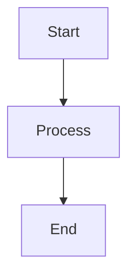

# 文档与编辑器

> 本文档整合了以下源文件：docs.md, markdown.md, editor.md, draw.md

---

## 来源：docs.md

全面的 Outline 设置和使用指南，这是一个开源团队知识库和文档平台。

## 目录

- [安装](#installation)
- [配置](#configuration)
- [工作区](#workspaces)
- [文档](#documents)
- [集合](#collections)
- [搜索](#search)
- [分享](#sharing)
- [API](#api)
- [集成](#integrations)
- [权限](#permissions)
- [模板](#templates)
- [Markdown 支持](#markdown-support)

---

## 安装

### 前置要求

| 要求 | 最低版本 | 用途 |
|------|----------|------|
| Node.js | 18+ | 应用运行时 |
| PostgreSQL | 12+ | 主数据库 |
| Redis | 6+ | 缓存和实时事件 |
| Yarn | 1.22+ | 包管理器 |

### Docker 安装（推荐）

```bash
git clone https://github.com/outline/outline.git
cd outline
cp .env.sample .env
```

编辑 `.env` 文件配置，然后：

```bash
docker compose up -d
```

这将启动 Outline、PostgreSQL、Redis 和存储容器。

### 手动安装

```bash
git clone https://github.com/outline/outline.git
cd outline
yarn install --frozen-lockfile
yarn build
yarn start
```

### 环境变量

| 变量 | 必需 | 描述 |
|------|------|------|
| `SECRET_KEY` | 是 | 会话加密的随机字符串 |
| `UTILS_SECRET` | 是 | 工具加密的随机字符串 |
| `DATABASE_URL` | 是 | PostgreSQL 连接字符串 |
| `REDIS_URL` | 是 | Redis 连接字符串 |
| `URL` | 是 | 实例的公开 URL |
| `PORT` | 否 | 服务器端口（默认: 3000） |
| `FILE_STORAGE` | 否 | `local` 或 `s3` |
| `AWS_ACCESS_KEY_ID` | S3 | AWS S3 存储访问密钥 |
| `AWS_SECRET_ACCESS_KEY` | S3 | AWS S3 存储密钥 |
| `AWS_S3_UPLOAD_BUCKET_NAME` | S3 | S3 桶名称 |

### 认证提供商

Outline 支持多种认证方式：

| 提供商 | 环境变量 | 描述 |
|--------|----------|------|
| Slack | `SLACK_CLIENT_ID` | 通过 Slack 工作区 OAuth |
| Google | `GOOGLE_CLIENT_ID` | 通过 Google 账号 OAuth |
| Microsoft | `MICROSOFT_CLIENT_ID` | 通过 Azure AD OAuth |
| OIDC | `OIDC_CLIENT_ID` | 通用 OpenID Connect |
| SAML | `SAML_*` | 企业 SSO |

---

## 配置

### 常规设置

通过侧边栏访问管理设置：`Settings > Administration`。

| 设置 | 描述 |
|------|------|
| 团队名称 | 工作区的显示名称 |
| 团队图标 | 工作区的 logo/头像 |
| 默认语言 | 所有用户的界面语言 |
| 默认访问 | 新成员的默认文档可见性 |
| 公开分享 | 允许文档公开分享 |
| 访客分享 | 允许与外部访客分享 |

### 文件存储配置

| 存储类型 | 配置 |
|----------|------|
| 本地 | 文件存储在 `./data` 目录 |
| Amazon S3 | 在环境变量中配置桶、区域、凭据 |
| Google Cloud Storage | 使用 S3 兼容 API 连接 GCS |
| MinIO | 自托管 S3 兼容存储 |

### 邮件配置

| 变量 | 描述 |
|------|------|
| `SMTP_HOST` | SMTP 服务器主机名 |
| `SMTP_PORT` | SMTP 服务器端口 |
| `SMTP_USERNAME` | 认证用户名 |
| `SMTP_PASSWORD` | 认证密码 |
| `SMTP_FROM_EMAIL` | 发件人邮箱 |
| `SMTP_REPLY_EMAIL` | 回复邮箱 |

### 速率限制

| 设置 | 默认值 | 描述 |
|------|--------|------|
| `RATE_LIMITER_ENABLED` | false | 启用速率限制 |
| `RATE_LIMITER_REQUESTS` | 1000 | 每窗口最大请求数 |
| `RATE_LIMITER_DURATION_WINDOW` | 60 | 窗口持续时间（秒） |

---

## 工作区

工作区是团队知识库的顶级容器。

### 工作区设置

| 设置 | 描述 |
|------|------|
| 名称 | 团队或组织名称 |
| 图标 | 工作区 logo |
| 子域名 | 自定义子域名（如 team.getoutline.com） |
| 允许域名 | 允许加入的邮箱域名 |
| 邀请分享 | 允许成员邀请他人 |
| 成员默认角色 | 分配给新成员的角色 |

### 管理成员

| 操作 | 方法 |
|------|------|
| 通过邮箱邀请 | Settings > Members > Invite |
| 通过链接邀请 | Settings > Members > Invite Link |
| 更改角色 | 点击成员 > 选择新角色 |
| 移除成员 | 点击成员 > Remove |
| 停用 | 点击成员 > Deactivate |

### 成员角色

| 角色 | 权限 |
|------|------|
| Viewer | 只读访问共享文档 |
| Member | 在共享集合中创建和编辑文档 |
| Admin | 完整工作区管理、成员邀请 |
| Owner | 所有管理员权限加计费和删除 |

---

## 文档

文档是 Outline 的核心内容单元。

### 创建文档

| 方式 | 方法 |
|------|------|
| 新建文档按钮 | 点击侧边栏 `+` |
| 快捷键 | 按 `Ctrl + N` |
| 从模板 | 创建时选择模板 |
| 导入 | 拖放 `.md`、`.docx` 或 `.txt` 文件 |

### 文档编辑器

编辑器是支持 Markdown 快捷键的块级富文本编辑器。

| 功能 | 方法 |
|------|------|
| 标题 | 输入 `#`、`##`、`###` 后加空格 |
| 粗体 | 选中文本按 `Ctrl + B` |
| 斜体 | 选中文本按 `Ctrl + I` |
| 行内代码 | 用反引号包裹文本 |
| 链接 | 选中文本按 `Ctrl + K` |
| 图片 | 从剪贴板粘贴或拖放 |
| 清单 | 输入 `[]` 后加空格 |
| 表格 | 输入 `/table` 或使用斜杠命令 |
| 分隔线 | 输入 `---` |
| 代码块 | 输入三个反引号或 `/code` |
| 嵌入 | 粘贴 URL 或使用 `/embed` |

### 文档操作

| 操作 | 方法 |
|------|------|
| 归档 | 移至归档（可恢复） |
| 删除 | 移至回收站（30 天内可恢复） |
| 移动 | 拖到其他集合或使用移动选项 |
| 复制 | 创建文档副本 |
| 置顶 | 置顶到集合顶部 |
| 收藏 | 添加到个人收藏列表 |
| 打印 | File > Print |
| 导出 | 下载为 Markdown、PDF 或 HTML |

### 文档属性

| 属性 | 描述 |
|------|------|
| 创建者 | 文档作者 |
| 创建时间 | 创建时间戳 |
| 最后编辑者 | 最近编辑者 |
| 最后编辑时间 | 最后编辑时间戳 |
| 字数 | 大约字数 |
| 协作者 | 编辑过文档的用户 |

### 版本历史

Outline 追踪所有文档变更：

1. 打开文档。
2. 点击顶部栏的时钟图标。
3. 按日期浏览历史版本。
4. 点击版本预览。
5. 如需要可恢复版本。

---

## 集合

集合是层级组织文档的文件夹。

### 创建集合

1. 点击侧边栏 Collections 旁的 `+`。
2. 输入集合名称。
3. 选择图标和颜色。
4. 设置权限（私有或工作区范围）。
5. 点击 `Create`。

### 集合类型

| 类型 | 可见性 | 用途 |
|------|--------|------|
| Private | 仅受邀成员 | 敏感文档 |
| Workspace | 所有工作区成员 | 共享团队知识 |
| Public | 有链接的任何人 | 外部文档 |

### 集合结构

集合支持嵌套文档（子文档）：

```
Engineering (Collection)
  Getting Started
  Architecture Overview
    Frontend
    Backend
    Database
  Deployment Guide
  API Documentation
```

### 集合设置

| 设置 | 描述 |
|------|------|
| 排序 | 字母、手动或最近更新 |
| 分享 | 控制谁可以访问 |
| 索引 | 手动排序文档 |
| 删除 | 删除集合及所有文档 |

---

## 搜索

Outline 提供跨所有可访问文档的全文搜索。

### 搜索功能

| 功能 | 描述 |
|------|------|
| 全文搜索 | 搜索文档标题和内容 |
| 即时结果 | 输入时显示结果 |
| 筛选 | 按集合、作者、日期筛选 |
| 最近搜索 | 快速重复之前的搜索 |
| 快捷键 | `Ctrl + K` 或 `/` 聚焦搜索 |

### 搜索运算符

| 运算符 | 示例 | 描述 |
|--------|------|------|
| `collection:` | `collection:Engineering` | 在集合中搜索 |
| `author:` | `author:John` | 按文档作者搜索 |
| `created:` | `created:2024-01-01` | 按创建日期筛选 |
| `updated:` | `updated:>2024-06-01` | 按更新日期筛选 |

### 搜索技巧

- 使用具体词语而非常见词。
- 组合运算符获得精确结果。
- 结果按相关性和时间排序。
- 你有权访问的文档会包含在结果中。

---

## 分享

### 内部分享

| 方式 | 方法 |
|------|------|
| 分享链接 | 点击 Share 按钮，复制链接 |
| 提及 | 在文档中输入 `@username` |
| 集合访问 | 将用户添加到集合权限 |

### 公开分享

1. 打开文档。
2. 点击 `Share`。
3. 切换 `Share publicly`。
4. 复制公开链接。

公开文档为只读，无需认证即可访问。

| 设置 | 描述 |
|------|------|
| 公开链接 | 任何人都可访问的 URL |
| 包含嵌套文档 | 公开分享子文档 |
| 撤销 | 禁用公开访问 |

### 访客访问

邀请外部协作者而不给予完整工作区访问权限：

1. 前往 `Settings > Members`。
2. 点击 `Invite` 并输入访客邮箱。
3. 选择 `Guest` 角色。
4. 选择要分享的特定集合。

### 分享链接设置

| 设置 | 描述 |
|------|------|
| 链接过期 | 设置过期日期 |
| 密码保护 | 需要密码查看 |
| 允许下载 | 允许 PDF/Markdown 下载 |

---

## API

Outline 提供 RESTful API 用于程序化访问。

### 认证

所有 API 请求需要个人 API token：

1. 前往 `Settings > API`。
2. 点击 `Create Token`。
3. 复制 token。

在请求中包含 token：

```
Authorization: Bearer YOUR_API_TOKEN
```

### API 端点

| 端点 | 方法 | 描述 |
|------|------|------|
| `/api/documents.list` | POST | 列出所有文档 |
| `/api/documents.info` | POST | 获取文档详情 |
| `/api/documents.create` | POST | 创建文档 |
| `/api/documents.update` | POST | 更新文档 |
| `/api/documents.delete` | POST | 删除文档 |
| `/api/documents.search` | POST | 搜索文档 |
| `/api/collections.list` | POST | 列出集合 |
| `/api/collections.create` | POST | 创建集合 |
| `/api/collections.info` | POST | 获取集合详情 |
| `/api/users.list` | POST | 列出工作区用户 |

### 示例：创建文档

```bash
curl -X POST https://your-outline.com/api/documents.create \
  -H "Authorization: Bearer YOUR_TOKEN" \
  -H "Content-Type: application/json" \
  -d '{
    "title": "API Created Document",
    "text": "# Hello\nThis document was created via API.",
    "collectionId": "COLLECTION_ID",
    "publish": true
  }'
```

### 速率限制

| 限制 | 值 |
|------|-----|
| 每分钟请求数 | 100/token |
| 负载大小 | 10 MB |

---

## 集成

### 内置集成

| 集成 | 描述 | 配置 |
|------|------|------|
| Slack | 搜索、分享和接收通知 | 在设置中添加 Slack 应用 |
| Google Drive | 嵌入 Google Docs、Sheets | 粘贴 Google URL |
| Figma | 嵌入 Figma 设计 | 粘贴 Figma URL |
| Loom | 嵌入 Loom 视频 | 粘贴 Loom URL |
| Lucidchart | 嵌入图表 | 粘贴 Lucidchart URL |

### Slack 集成

| 功能 | 描述 |
|------|------|
| `/outline search` | 从 Slack 搜索文档 |
| 链接预览 | 在 Slack 中预览 Outline 链接 |
| 通知 | 在频道接收文档更新 |
| 自动发布 | 将新文档发布到频道 |

### Webhook 集成

配置 webhook 接收事件：

1. 前往 `Settings > Webhooks`。
2. 点击 `Add Webhook`。
3. 输入目标 URL。
4. 选择要订阅的事件。

| 事件 | 触发 |
|------|------|
| `documents.create` | 新文档创建 |
| `documents.update` | 文档编辑 |
| `documents.delete` | 文档删除 |
| `collections.create` | 新集合创建 |
| `users.create` | 新用户加入 |

### Zapier 集成

通过 Zapier 将 Outline 连接到 5000+ 应用：

| 触发 | 动作 |
|------|------|
| 新文档 | 创建 Trello 卡片 |
| 文档更新 | 发送 Slack 消息 |
| 新集合 | 创建 Notion 页面 |

---

## 权限

### 权限级别

| 级别 | 描述 |
|------|------|
| 读取 | 查看文档内容 |
| 读写 | 查看和编辑文档 |
| Admin | 管理集合设置和成员 |

### 集合权限

| 设置 | 选项 |
|------|------|
| 谁可以查看 | 所有人、特定组、受邀用户 |
| 谁可以编辑 | 所有人、特定组、受邀用户 |
| 谁可以管理 | 仅管理员 |
| 嵌套文档继承 | 子文档继承父文档权限 |

### 文档级权限

文档可以拥有独立于集合的权限：

| 设置 | 描述 |
|------|------|
| Public | 有链接的任何人都可查看 |
| Invite-only | 仅明确受邀用户 |
| Collection default | 从父集合继承 |

### 权限继承

```
Collection (Edit: Team A)
  Document A (inherits Collection)
  Document B (Custom: Team B only)
  Document C (Public)
```

### 组

创建组以高效管理权限：

1. 前往 `Settings > Groups`。
2. 创建组（如 "Engineering"、"Marketing"）。
3. 添加成员到组。
4. 将组分配到集合权限。

---

## 模板

模板提供可复用的文档结构。

### 创建模板

1. 创建具有所需结构的文档。
2. 点击 `...` 菜单。
3. 选择 `Save as template`。
4. 命名模板。

### 模板功能

| 功能 | 描述 |
|------|------|
| 占位文本 | 用示例文本引导内容 |
| 结构化标题 | 预定义的章节标题 |
| 清单 | 可复用的任务列表 |
| 表格 | 预格式化的数据表 |
| 变量 | 使用 `{{variable}}` 实现动态内容 |

### 使用模板

| 方式 | 方法 |
|------|------|
| 新文档 | 从下拉菜单选择模板 |
| 现有文档 | 插入模板内容 |
| 斜杠命令 | 在编辑器中输入 `/template` |

### 模板管理

| 操作 | 方法 |
|------|------|
| 查看所有模板 | Settings > Templates |
| 编辑模板 | 打开模板，进行修改 |
| 删除模板 | 模板列表 > Delete |
| 复制模板 | 模板列表 > Duplicate |

### 默认模板

为集合设置默认模板：

1. 打开集合设置。
2. 选择 `Default template`。
3. 选择模板。

此集合中的新文档将从模板内容开始。

---

## Markdown 支持

Outline 的编辑器支持 Markdown 语法，便于快速创建内容。

### 支持的语法

| 元素 | 语法 | 结果 |
|------|------|------|
| 标题 1 | `# H1` | 大标题 |
| 标题 2 | `## H2` | 中标题 |
| 标题 3 | `### H3` | 小标题 |
| 粗体 | `**text**` | **粗体文本** |
| 斜体 | `*text*` | *斜体文本* |
| 删除线 | `~~text~~` | ~~删除线~~ |
| 行内代码 | `` `code` `` | `code` |
| 代码块 | ``` ``` | 代码块 |
| 链接 | `[text](url)` | 超链接 |
| 图片 | `` | 内联图片 |
| 引用 | `> text` | 引用文本 |
| 有序列表 | `1. item` | 编号列表 |
| 无序列表 | `- item` | 项目列表 |
| 清单 | `[] item` | 复选框 |
| 水平线 | `---` | 分隔线 |
| 表格 | 见下文 | 数据表 |

### 表格语法

```markdown
| Header 1 | Header 2 | Header 3 |
|---|---|---|
| Cell 1 | Cell 2 | Cell 3 |
| Cell 4 | Cell 5 | Cell 6 |
```

### 斜杠命令

在编辑器中输入 `/` 访问块命令：

| 命令 | 描述 |
|------|------|
| `/heading1` | 插入 H1 标题 |
| `/heading2` | 插入 H2 标题 |
| `/bullet-list` | 插入项目列表 |
| `/ordered-list` | 插入编号列表 |
| `/checklist` | 插入清单 |
| `/code` | 插入代码块 |
| `/table` | 插入表格 |
| `/blockquote` | 插入引用 |
| `/hr` | 插入水平线 |
| `/image` | 插入图片 |
| `/embed` | 嵌入外部内容 |
| `/template` | 插入模板 |

### Markdown 快捷键

| 快捷键 | 操作 |
|--------|------|
| `Ctrl + B` | 粗体 |
| `Ctrl + I` | 斜体 |
| `Ctrl + K` | 插入链接 |
| `Ctrl + Shift + C` | 行内代码 |
| `Ctrl + Shift + H` | 循环标题级别 |
| `Ctrl + Shift + 7` | 有序列表 |
| `Ctrl + Shift + 8` | 无序列表 |
| `Ctrl + Shift + 9` | 清单 |
| `Ctrl + ]` | 缩进 |
| `Ctrl + [` | 减少缩进 |

### 导入 Markdown

直接导入 `.md` 文件：

1. 将 `.md` 文件拖放到 Outline 中。
2. 或使用 `File > Import > Markdown`。
3. 文档保留标题、列表、表格和链接。


---

## 来源：markdown.md

## 简介

MarkText 是一款免费、开源的 Markdown 编辑器，提供简洁的写作体验和实时预览。它拥有无干扰的界面，专注于 Markdown 文档写作。

### 什么是 MarkText？

MarkText 是一款桌面 Markdown 编辑器，专注于简洁和写作体验。它支持 CommonMark 和 GitHub Flavored Markdown 规范。

| 特性 | 描述 |
|------|------|
| 实时预览 | 实时渲染 |
| 多主题 | 亮色和暗色主题 |
| 专注模式 | 高亮当前段落 |
| 打字机模式 | 居中当前行 |
| 导出选项 | PDF、HTML、图片 |

### 与其他编辑器的比较

| 特性 | MarkText | Typora | Obsidian |
|------|----------|--------|----------|
| 免费 | 是 | 否 | 免费增值 |
| 开源 | 是 | 否 | 否 |
| 实时预览 | 是 | 是 | 否 |
| 侧边栏 | 否 | 否 | 是 |
| 导出 | PDF、HTML | 多种 | 有限 |

## 安装

### 系统要求

| 平台 | 要求 |
|------|------|
| Windows | Windows 7+ |
| macOS | macOS 10.13+ |
| Linux | Ubuntu 18.04+、Fedora 28+ |

### 安装方式

```bash
# macOS (Homebrew)
brew install --cask mark-text

# Windows (Winget)
winget install marktext.marktext

# Linux (AppImage)
# 从 GitHub releases 下载
chmod +x MarkText.AppImage
./MarkText.AppImage
```

### 下载

访问 https://github.com/marktext/marktext/releases 获取官方安装包。

## 界面概览

### 主要组件

| 组件 | 用途 |
|------|------|
| 编辑区 | 编写 Markdown |
| 标题栏 | 文档标题 |
| 工具栏 | 格式化按钮 |
| 侧边栏 | 文件浏览器（可选） |

### 视图模式

| 模式 | 描述 |
|------|------|
| 源码 | 原始 Markdown |
| 实时预览 | 并排显示 |
| WYSIWYG | 所见即所得 |

## Markdown 语法

### 基本格式

| 语法 | 结果 |
|------|------|
| `**bold**` | **bold** |
| `*italic*` | *italic* |
| `~~strikethrough~~` | ~~strikethrough~~ |
| `# Heading 1` | Heading 1 |
| `## Heading 2` | Heading 2 |

### 列表

```markdown
- Unordered item 1
- Unordered item 2
  - Nested item

1. Ordered item 1
2. Ordered item 2
```

### 任务列表

```markdown
- [x] Completed task
- [ ] Incomplete task
- [ ] Another task
```

### 链接和图片

```markdown
[Link text](https://example.com)

```

### 代码

```markdown
Inline `code` with backticks

```language
Code block with syntax highlighting
```
```

### 表格

```markdown
| Header 1 | Header 2 |
|----------|----------|
| Cell 1   | Cell 2   |
| Cell 3   | Cell 4   |
```

### 引用

```markdown
> This is a blockquote
> It can span multiple lines
```

## 编辑器功能

### 专注模式

专注模式会淡化除当前正在编辑的段落以外的所有段落，帮助您专注于写作。

| 模式 | 描述 |
|------|------|
| 专注模式 | 高亮当前段落 |
| 打字机模式 | 居中当前行 |
| 源码模式 | 原始 Markdown 编辑 |

### 自动保存

MarkText 自动保存您的工作：

| 设置 | 选项 |
|------|------|
| 自动保存 | 启用/禁用 |
| 保存间隔 | 秒 |
| 备份 | 创建备份 |

### 拼写检查

| 语言 | 支持 |
|------|------|
| 英语 | 完全 |
| 其他语言 | 通过系统词典 |

## 主题

### 内置主题

| 主题 | 风格 |
|------|------|
| Default | 简洁亮色 |
| Dark | 暗色模式 |
| Graphite | 灰色调 |
| Material Dark | Material 设计 |
| One Dark | Atom 风格 |
| Ulysses | 写作导向 |

### 自定义主题

```css
/* Custom theme CSS */
.markdown-body {
  font-family: "Custom Font", sans-serif;
  font-size: 16px;
  line-height: 1.6;
}
```

## 键盘快捷键

### 常用快捷键

| 操作 | Windows/Linux | macOS |
|------|--------------|-------|
| 粗体 | Ctrl+B | Cmd+B |
| 斜体 | Ctrl+I | Cmd+I |
| 链接 | Ctrl+L | Cmd+L |
| 图片 | Ctrl+Shift+I | Cmd+Shift+I |
| 代码 | Ctrl+` | Cmd+` |
| 标题 | Ctrl+H | Cmd+H |

### 文件操作

| 操作 | Windows/Linux | macOS |
|------|--------------|-------|
| 新建文件 | Ctrl+N | Cmd+N |
| 打开文件 | Ctrl+O | Cmd+O |
| 保存 | Ctrl+S | Cmd+S |
| 另存为 | Ctrl+Shift+S | Cmd+Shift+S |
| 导出 PDF | Ctrl+E | Cmd+E |

### 编辑

| 操作 | Windows/Linux | macOS |
|------|--------------|-------|
| 撤销 | Ctrl+Z | Cmd+Z |
| 重做 | Ctrl+Shift+Z | Cmd+Shift+Z |
| 查找 | Ctrl+F | Cmd+F |
| 替换 | Ctrl+H | Cmd+H |

## 导出选项

### 支持的格式

| 格式 | 描述 |
|------|------|
| PDF | 便携式文档格式 |
| HTML | 网页 |
| Image | PNG 截图 |
| Styled HTML | 带 CSS 的 HTML |

### 导出配置

| 设置 | 选项 |
|------|------|
| 页面大小 | A4、Letter、自定义 |
| 页边距 | 可配置 |
| 页眉/页脚 | 可选 |
| CSS 样式 | 自定义样式 |

### 导出流程

1. 编写 Markdown 文档
2. 进入 File > Export
3. 选择格式
4. 配置选项
5. 保存文件

## 配置

### 偏好设置

| 设置 | 描述 |
|------|------|
| 字体族 | 编辑器字体 |
| 字体大小 | 文本大小 |
| 行高 | 行间距 |
| Tab 大小 | 缩进宽度 |
| 自动配对 | 自动关闭括号 |

### 配置文件

```json
{
  "fontSize": 16,
  "fontFamily": "Monaco",
  "lineHeight": 1.6,
  "tabSize": 2,
  "autoSave": true,
  "autoSaveDelay": 5000,
  "theme": "default"
```

## 文件管理

### 支持的文件类型

| 扩展名 | 支持 |
|--------|------|
| .md | 完全支持 |
| .markdown | 完全支持 |
| .mmd | Mermaid 图表 |
| .txt | 纯文本 |

### 文件浏览器

| 功能 | 描述 |
|------|------|
| 打开文件夹 | 浏览文件夹内容 |
| 文件树 | 层级视图 |
| 快速切换 | 在文件之间切换 |

## 图表和扩展

### Mermaid 图表

```markdown

```

### 支持的图表

| 类型 | 语法 |
|------|------|
| 流程图 | `graph TD` |
| 时序图 | `sequenceDiagram` |
| 甘特图 | `gantt` |
| 类图 | `classDiagram` |

### 数学公式

```markdown
Inline: $E = mc^2$

Block:
$$
\sum_{i=1}^{n} i = \frac{n(n+1)}{2}
$$
```

## 性能

### 优化技巧

| 技巧 | 描述 |
|------|------|
| 禁用动画 | 减少视觉效果 |
| 限制打开文件 | 关闭未使用的标签 |
| 使用纯文本模式 | 处理大文件 |
| 禁用拼写检查 | 不需要时 |

## 故障排除

### 常见问题

| 问题 | 解决方案 |
|------|----------|
| 渲染缓慢 | 禁用扩展 |
| 导出失败 | 检查文件权限 |
| 字体问题 | 安装所需字体 |
| 崩溃 | 更新到最新版本 |

### 日志

日志存储在：

| 平台 | 位置 |
|------|------|
| Windows | `%APPDATA%/marktext/logs` |
| macOS | `~/Library/Logs/marktext` |
| Linux | `~/.config/marktext/logs` |

## 总结

| 功能 | 描述 |
|------|------|
| 实时预览 | 实时 Markdown 渲染 |
| 主题 | 外观定制 |
| 导出 | PDF、HTML、图片 |
| 快捷键 | 高效编辑 |
| 图表 | Mermaid 支持 |
| 数学 | LaTeX 公式支持 |


---

## 来源：editor.md

## 简介

Zettlr 是一款免费、开源的 Markdown 编辑器，专为学术写作、笔记记录和知识管理设计。它支持 Zettelkasten 方法论、引用管理，并可导出为多种格式，包括 PDF、DOCX 和 HTML。

| 特性 | 描述 |
|---------|-------------|
| Markdown 编辑 | 完整 Markdown 支持，带实时预览 |
| Zettelkasten | 基于链接的知识管理系统 |
| 引用 | 与 Zotero 和 BibTeX 集成 |
| 导出 | PDF、DOCX、HTML 和 LaTeX 导出 |
| 跨平台 | Windows、macOS 和 Linux |

## 核心概念

### Markdown 基础

| 语法 | 结果 |
|--------|--------|
| `# 标题 1` | 一级标题 |
| `## 标题 2` | 二级标题 |
| `**bold**` | **粗体文本** |
| `*italic*` | *斜体文本* |
| `[link](url)` | 超链接 |
| `` | 图片 |
| `- item` | 无序列表 |
| `1. item` | 有序列表 |
| `` `code` `` | 行内代码 |
| ```` ``` ```` | 代码块 |
| `> quote` | 引用块 |
| `---` | 水平线 |

### Zettelkasten 方法

| 概念 | 描述 |
|---------|-------------|
| Zettel | 带唯一 ID 的独立笔记 |
| 链接 | 相关笔记之间的连接 |
| 标签 | 分类标签 |
| 结构笔记 | 组织主题的索引笔记 |
| Folgezettel | 顺序笔记链 |

## 安装

### 下载和安装

| 平台 | 方法 |
|----------|--------|
| Windows | 从 zettlr.com 下载安装程序 |
| macOS | 下载 DMG 或使用 Homebrew：`brew install --cask zettlr` |
| Ubuntu/Debian | 从发布页面下载 .deb 包 |
| Fedora | 下载 .rpm 包 |
| Arch Linux | `yay -S zettlr` |

### 系统要求

| 组件 | 最低要求 | 推荐配置 |
|-----------|---------|-------------|
| CPU | 64 位处理器 | 多核 |
| 内存 | 2 GB | 4 GB+ |
| 存储 | 200 MB | 1 GB+ |
| 显示 | 1280x720 | 1920x1080+ |

## 界面概述

### 主布局

| 区域 | 描述 |
|---------|-------------|
| 文件管理器 | 左侧栏，带文件树 |
| 编辑器 | 主编辑区域，Markdown |
| 预览 | 右侧栏，带渲染预览 |
| 工具栏 | 顶部工具栏，带格式按钮 |
| 状态栏 | 底部栏，带文档统计 |

### 编辑器模式

| 模式 | 描述 |
|------|-------------|
| Default | 标准 Markdown 编辑 |
| Minimal | 无干扰写作 |
| Presentation | 幻灯片演示模式 |
| Code | 原始 Markdown 源编辑 |

## 文件管理

### 项目结构

| 元素 | 描述 |
|---------|-------------|
| 根目录 | 主项目文件夹 |
| 子目录 | 组织笔记的文件夹 |
| 文件 | 独立 Markdown 文件 |
| 附件 | 图片和其他文件 |

### 文件操作

| 操作 | 快捷键 | 描述 |
|--------|----------|-------------|
| 新建文件 | Ctrl+N | 创建新 Markdown 文件 |
| 打开文件 | Ctrl+O | 打开现有文件 |
| 保存 | Ctrl+S | 保存当前文件 |
| 快速打开 | Ctrl+P | 模糊文件搜索 |
| 新建目录 | - | 创建新文件夹 |

### 支持的文件格式

| 格式 | 读取 | 写入 |
|--------|------|-------|
| Markdown (.md) | 是 | 是 |
| Text (.txt) | 是 | 是 |
| YAML (.yaml) | 是 | 是 |
| JSON (.json) | 是 | 否 |
| LaTeX (.tex) | 是 | 是 |
| HTML (.html) | 是 | 是 |

## 写作功能

### 格式工具栏

| 按钮 | 功能 |
|--------|----------|
| Bold | 使文本加粗（Ctrl+B） |
| Italic | 使文本倾斜（Ctrl+I） |
| Code | 行内代码格式 |
| Link | 插入超链接（Ctrl+K） |
| Image | 插入图片 |
| List | 切换无序列表 |
| Numbered | 切换有序列表 |
| Quote | 切换引用块 |
| Heading | 循环切换标题级别 |

### 键盘快捷键

| 快捷键 | 操作 |
|----------|--------|
| Ctrl+B | 加粗 |
| Ctrl+I | 斜体 |
| Ctrl+K | 插入链接 |
| Ctrl+Shift+I | 插入图片 |
| Ctrl+L | 插入列表 |
| Ctrl+Shift+L | 插入有序列表 |
| Ctrl+Q | 插入引用块 |
| Ctrl+1-6 | 标题级别 1-6 |
| Ctrl+` | 切换代码块 |
| Ctrl+H | 查找和替换 |

### 自动补全

| 触发 | 补全 |
|---------|------------|
| `[[` | 内部笔记链接 |
| `#` | 标签 |
| `@` | 引用 |
| `::` | 表情符号 |
| `/` | 斜杠命令 |

## Zettelkasten 功能

### 创建链接

| 方式 | 描述 |
|--------|-------------|
| 内部链接 | `[[笔记标题]]` |
| 带锚点 | `[[笔记标题#标题]]` |
| 带别名 | `[[笔记标题\|显示文本]]` |
| 外部链接 | `[text](url)` |

### 标签系统

| 标签类型 | 语法 | 示例 |
|----------|--------|---------|
| 行内标签 | `#tag` | `#research` |
| 嵌套标签 | `#parent/child` | `#project/research` |
| 多词标签 | `#[multi word tag]` | `#[machine learning]` |

### 文件 ID 配置

| 设置 | 描述 | 示例 |
|---------|-------------|---------|
| Pattern | ID 生成模式 | `%Y%m%d%H%M%S` |
| Prefix | ID 前缀 | `zettel-` |
| Suffix | ID 后缀 | `-note` |

### 生成的 ID 示例

```
20240115143025.md → 20240115143025
zettel-20240115-note.md → zettel-20240115-note
```

## 引用管理

### Zotero 集成

| 步骤 | 操作 |
|------|--------|
| 1 | 安装 Zotero 和 Better BibTeX 插件 |
| 2 | 导出参考文献为 .bib 文件 |
| 3 | 配置 Zettlr 使用 .bib 文件 |
| 4 | 使用 @citation-key 插入引用 |

### 引用语法

| 语法 | 结果 |
|--------|--------|
| `@smith2020` | Smith (2020) |
| `[@smith2020]` | (Smith, 2020) |
| `[@smith2020, p. 42]` | (Smith, 2020, p. 42) |
| `[see @smith2020; @jones2021]` | (see Smith, 2020; Jones, 2021) |

### 参考文献生成

```markdown
# 参考文献

::: {#refs}
:::
```

## 导出选项

### 导出格式

| 格式 | 描述 | 要求 |
|--------|-------------|-------------|
| PDF | 便携式文档格式 | Pandoc + LaTeX |
| DOCX | Microsoft Word | Pandoc |
| HTML | 网页 | Pandoc |
| LaTeX | LaTeX 源码 | Pandoc |
| ODT | OpenDocument Text | Pandoc |
| RTF | 富文本格式 | Pandoc |
| Plain Text | 纯文本 | 内置 |

### Pandoc 配置

| 设置 | 描述 |
|---------|-------------|
| Pandoc 路径 | Pandoc 可执行文件路径 |
| LaTeX 发行版 | 用于 PDF 导出的 TeX Live 或 MiKTeX |
| 参考文档 | 用于 DOCX 导出的自定义模板 |
| CSL 文件 | 用于引用的 Citation Style Language |

### 导出设置

| 设置 | 描述 |
|---------|-------------|
| Title | 文档标题 |
| Author | 作者姓名 |
| Date | 出版日期 |
| Template | 导出模板文件 |
| Bibliography | 引用数据库文件 |
| CSL | 引用样式文件 |

## 外观

### 主题

| 主题 | 描述 |
|-------|-------------|
| Berlin | 简洁现代界面 |
| Frankfurt | 经典编辑器外观 |
| Bielefeld | 极简设计 |
| Karl Marx Stadt | 暗色主题 |
| Custom | 用户自定义 CSS 主题 |

### 字体设置

| 设置 | 描述 |
|---------|-------------|
| 编辑器字体 | 编辑器中使用的字体 |
| 字体大小 | 编辑器文本大小 |
| 行高 | 行间距 |
| 代码字体 | 代码块字体 |

### 编辑器设置

| 设置 | 描述 |
|---------|-------------|
| 行号 | 在编辑器中显示行号 |
| 自动换行 | 长行换行 |
| 拼写检查 | 启用拼写检查器 |
| 打字机模式 | 保持光标垂直居中 |
| 聚焦模式 | 使非活跃段落变暗 |

## 搜索和过滤

### 搜索选项

| 选项 | 描述 |
|--------|-------------|
| 在文件中查找 | 在当前文档内搜索 |
| 在目录中查找 | 跨多个文件搜索 |
| 正则表达式 | 使用正则模式 |
| 区分大小写 | 精确匹配大小写 |
| 全词匹配 | 仅匹配完整单词 |

### 过滤器

| 过滤器 | 描述 |
|--------|-------------|
| 标签过滤 | 显示带有特定标签的文件 |
| 文件过滤 | 按文件名过滤 |
| 日期过滤 | 按修改日期过滤 |
| ID 过滤 | 按 Zettel ID 过滤 |

## 键盘导航

### 导航快捷键

| 快捷键 | 操作 |
|----------|--------|
| Ctrl+G | 跳转到行 |
| Ctrl+P | 快速打开文件 |
| Ctrl+Tab | 在打开的文件间切换 |
| Ctrl+Shift+F | 全局搜索 |
| Alt+Left | 后退 |
| Alt+Right | 前进 |

## 总结

| 主题 | 核心要点 |
|-------|-------------|
| 用途 | 面向学术的 Markdown 编辑器，带知识管理 |
| Zettelkasten | 基于链接的笔记，带唯一 ID 和标签 |
| 引用 | Zotero 集成，使用 @citation-key 语法 |
| 导出 | 通过 Pandoc 导出 PDF、DOCX、HTML |
| 界面 | 分屏视图，带文件管理器、编辑器和预览 |
| 自定义 | 主题、字体和键盘快捷键 |


---

## 来源：draw.md

## 目录

1. [Nicooo 简介](#introduction)
2. [快速入门](#getting-started)
3. [绘画工具](#drawing-tools)
4. [画布管理](#canvas)
5. [协作功能](#collaboration)
6. [图层与组织](#layers)
7. [导出与分享](#export)
8. [高级技巧](#advanced)

---

## 简介

Nicooo 是一款协作绘画应用，支持与他人实时创作。它提供直觉化的绘画工具，适用于素描、插画和协作艺术项目。

### Nicooo 核心功能

| 功能 | 描述 | 好处 |
|------|------|------|
| 实时协作 | 多用户同时绘画 | 团队创意 |
| 基于浏览器 | 无需安装 | 轻松访问 |
| 简洁界面 | 学习曲线低 | 快速上手 |
| 矢量图形 | 可缩放绘图 | 保持质量 |
| 导出选项 | 多种格式 | 灵活输出 |

### 用例

| 用例 | 描述 | 受众 |
|------|------|------|
| 头脑风暴 | 可视化创意探索 | 团队 |
| 教育 | 互动课程 | 教师、学生 |
| 设计 | 概念草图 | 设计师 |
| 娱乐 | 协作艺术 | 任何人 |

### 系统要求

| 组件 | 要求 |
|------|------|
| 浏览器 | 现代浏览器（Chrome, Firefox, Safari） |
| 网络 | 稳定连接 |
| 设备 | 桌面或平板 |
| 输入 | 推荐鼠标或触控笔 |

---

## 快速入门

设置并开始你的第一次绘画会话。

### 访问 Nicooo

| 步骤 | 操作 | 备注 |
|------|------|------|
| 1 | 打开浏览器 | 推荐 Chrome |
| 2 | 导航到 URL | nicooo.org |
| 3 | 创建房间 | 用于协作 |
| 4 | 分享链接 | 邀请他人 |
| 5 | 开始绘画 | 使用工具 |

### 界面概述

| 区域 | 位置 | 用途 |
|------|------|------|
| 画布 | 中央 | 绘画区域 |
| 工具栏 | 左侧 | 绘画工具 |
| 颜色选择器 | 右侧 | 颜色选择 |
| 图层 | 右侧面板 | 图层管理 |
| 用户 | 右上角 | 协作者 |

### 基本控制

| 操作 | 鼠标 | 触摸 | 键盘 |
|------|------|------|------|
| 绘画 | 点击+拖动 | 触摸+拖动 | - |
| 平移 | 中键点击 | 双指 | 空格+拖动 |
| 缩放 | 滚轮 | 捏合 | Ctrl + / - |
| 撤销 | - | - | Ctrl + Z |
| 重做 | - | - | Ctrl + Y |

---

## 绘画工具

Nicooo 提供多种工具满足不同绘画需求。

### 工具概述

| 工具 | 快捷键 | 用途 |
|------|--------|------|
| 铅笔 | P | 自由绘画 |
| 画笔 | B | 可变宽度笔触 |
| 直线 | L | 直线 |
| 矩形 | R | 矩形、正方形 |
| 圆形 | C | 圆形、椭圆 |
| 文本 | T | 添加文字 |
| 橡皮擦 | E | 擦除内容 |
| 填充 | F | 填充形状 |

### 画笔设置

| 设置 | 范围 | 效果 |
|------|------|------|
| 大小 | 1-100px | 笔触宽度 |
| 不透明度 | 0-100% | 透明度 |
| 硬度 | 0-100% | 边缘柔和度 |
| 颜色 | RGB/HEX | 笔触颜色 |

### 形状工具

| 工具 | 约束 | 修饰符 |
|------|------|--------|
| 矩形 | 无 | 自由形式 |
| 正方形 | 按住 Shift | 完美正方形 |
| 椭圆 | 无 | 自由形式 |
| 圆形 | 按住 Shift | 完美圆形 |
| 直线 | 无 | 任意角度 |
| 水平/垂直线 | 按住 Shift | 45 度递增 |

### 文本工具选项

| 设置 | 选项 | 用途 |
|------|------|------|
| 字体 | 系统字体 | 样式 |
| 大小 | 8-200px | 可读性 |
| 粗体 | 开/关 | 强调 |
| 斜体 | 开/关 | 样式 |
| 颜色 | RGB/HEX | 可见性 |

### 键盘快捷键

| 快捷键 | 操作 |
|--------|------|
| Ctrl + Z | 撤销 |
| Ctrl + Y | 重做 |
| Ctrl + C | 复制 |
| Ctrl + V | 粘贴 |
| Ctrl + S | 保存 |
| [ / ] | 减小/增大画笔大小 |

---

## 画布管理

管理绘画画布以获得最佳工作流。

### 画布设置

| 设置 | 选项 | 默认值 |
|------|------|--------|
| 大小 | 自定义、预设 | 1920x1080 |
| 背景 | 白色、透明 | 白色 |
| 网格 | 开/关 | 关闭 |
| 吸附 | 开/关 | 关闭 |

### 视口控制

| 操作 | 方法 | 快捷键 |
|------|------|--------|
| 放大 | 向上滚动 | Ctrl + = |
| 缩小 | 向下滚动 | Ctrl + - |
| 适应屏幕 | 双击画布 | Ctrl + 0 |
| 重置缩放 | 菜单选项 | Ctrl + 1 |

### 网格和参考线

| 功能 | 描述 | 用途 |
|------|------|------|
| 网格 | 可视参考 | 对齐 |
| 吸附到网格 | 自动对齐 | 精确 |
| 标尺 | 测量 | 比例 |
| 参考线 | 自定义线条 | 布局 |

### 画布导航

| 方式 | 描述 | 最适合 |
|------|------|--------|
| 滚动条 | 手动平移 | 桌面 |
| 平移工具 | 点击拖动 | 触摸设备 |
| 空格+拖动 | 快速平移 | 键盘用户 |
| 小地图 | 概览导航 | 大画布 |

---

## 协作功能

实时协作是 Nicooo 的核心功能。

### 创建会话

| 步骤 | 操作 | 结果 |
|------|------|------|
| 1 | 点击"新房间" | 房间创建 |
| 2 | 复制链接 | 可分享 URL |
| 3 | 发送给协作者 | 他们加入 |
| 4 | 一起开始绘画 | 实时同步 |

### 协作功能

| 功能 | 描述 | 限制 |
|------|------|------|
| 光标追踪 | 看到他人光标 | 实时 |
| 同时绘画 | 多用户 | 无限制 |
| 聊天 | 文字通信 | 仅文字 |
| 语音 | 音频通信 | 浏览器支持 |

### 用户管理

| 角色 | 权限 | 可以做 |
|------|------|--------|
| Owner | 完全控制 | 所有操作 |
| Editor | 绘画和编辑 | 绘画工具 |
| Viewer | 仅观看 | 不能绘画 |

### 协作技巧

| 技巧 | 描述 | 好处 |
|------|------|------|
| 使用图层 | 分离各人贡献 | 有条理 |
| 沟通 | 使用聊天/语音 | 协调 |
| 轮流 | 避免冲突 | 清晰结果 |
| 命名图层 | 标识区域 | 清晰 |

### 冲突解决

| 冲突 | 解决方案 |
|------|----------|
| 重叠绘图 | 使用独立图层 |
| 颜色分歧 | 在聊天中讨论 |
| 风格差异 | 分配区域 |
| 意外编辑 | 使用撤销 |

---

## 图层与组织

有效使用图层处理复杂绘图。

### 图层基础

| 概念 | 描述 | 用途 |
|------|------|------|
| 图层 | 透明表面 | 组织 |
| 堆叠 | 图层顺序 | 可见性 |
| 可见性 | 显示/隐藏 | 聚焦 |
| 不透明度 | 透明度 | 混合 |

### 图层操作

| 操作 | 描述 | 快捷键 |
|------|------|--------|
| 添加图层 | 新图层 | Ctrl + Shift + N |
| 删除图层 | 移除图层 | Delete |
| 复制 | 复制图层 | Ctrl + J |
| 合并 | 合并图层 | Ctrl + E |
| 拼合 | 全部合并为一 | - |

### 图层组织策略

| 策略 | 描述 | 用途 |
|------|------|------|
| 按元素 | 背景、前景 | 复杂场景 |
| 按用户 | 每人一个图层 | 协作 |
| 按颜色 | 颜色分组 | 配色工作 |
| 按细节 | 草稿、精细 | 迭代工作 |

### 图层混合模式

| 模式 | 效果 | 用途 |
|------|------|------|
| Normal | 标准 | 默认 |
| Multiply | 变暗 | 阴影 |
| Screen | 变亮 | 高光 |
| Overlay | 增强对比 | 效果 |

---

## 导出与分享

以各种格式导出你的创作。

### 导出格式

| 格式 | 类型 | 质量 | 文件大小 |
|------|------|------|----------|
| PNG | 光栅 | 无损 | 大 |
| JPEG | 光栅 | 有损 | 小 |
| SVG | 矢量 | 无限 | 小 |
| PDF | 文档 | 高 | 中等 |

### 导出设置

| 设置 | 选项 | 推荐 |
|------|------|------|
| 分辨率 | 72-300 DPI | 网页用 150 DPI |
| 质量 | 0-100% | JPEG 用 90% |
| 背景 | 包含/透明 | 根据需要 |
| 图层 | 拼合/保留 | 分享时拼合 |

### 导出流程

| 步骤 | 操作 | 备注 |
|------|------|------|
| 1 | 文件 > 导出 | 打开对话框 |
| 2 | 选择格式 | PNG, JPEG, SVG, PDF |
| 3 | 设置选项 | 质量、分辨率 |
| 4 | 选择位置 | 保存目的地 |
| 5 | 导出 | 生成文件 |

### 分享选项

| 方式 | 描述 | 限制 |
|------|------|------|
| 直接链接 | 分享房间 URL | 仅实时 |
| 导出文件 | 下载图片 | 静态 |
| 嵌入 | 网站 iframe | 公开房间 |
| 社交媒体 | 直接分享 | 平台特定 |

---

## 高级技巧

提升绘图效果的高级技巧。

### 色彩理论基础

| 概念 | 描述 | 应用 |
|------|------|------|
| 色相 | 颜色类型 | 红、蓝、绿 |
| 饱和度 | 颜色强度 | 鲜艳 vs 柔和 |
| 明度 | 亮度/暗度 | 对比 |
| 互补色 | 相对颜色 | 对比效果 |

### 颜色混合

| 原色 | 次色 | 结果 |
|------|------|------|
| 红 + 蓝 | 紫色 | 紫罗兰 |
| 蓝 + 绿 | 青色 | 蓝绿 |
| 红 + 黄 | 橙色 | 暖色调 |
| 三色混合 | 棕/黑 | 中性色 |

### 混合技巧

| 技巧 | 工具 | 效果 |
|------|------|------|
| 涂抹 | 涂抹工具 | 颜色混合 |
| 渐变 | 渐变工具 | 平滑过渡 |
| 图层不透明度 | 图层设置 | 微妙叠加 |
| 柔边画笔 | 低硬度 | 柔和混合 |

### 线稿技巧

| 技巧 | 描述 | 效果 |
|------|------|------|
| 快速笔触 | 快速、自信的线条 | 干净的画面 |
| 放大 | 细节工作 | 精确 |
| 变化力度 | 动态线条 | 趣味 |
| 封闭间隙 | 便于填充工具 | 干净填充 |

### 性能优化

| 问题 | 原因 | 解决方案 |
|------|------|----------|
| 卡顿 | 图层太多 | 合并图层 |
| 缩放慢 | 画布太大 | 降低分辨率 |
| 崩溃 | 内存使用 | 关闭其他标签页 |
| 同步问题 | 网络 | 检查连接 |

---

## 总结

| 主题 | 核心要点 |
|------|----------|
| 访问 | 基于浏览器，无需安装 |
| 工具 | 铅笔、画笔、形状、文本 |
| 协作 | 多用户实时绘画 |
| 图层 | 组织复杂绘图 |
| 导出 | PNG, JPEG, SVG, PDF |
| 高级 | 色彩理论和混合技巧 |


---
