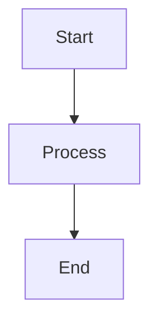

# 使用 MarkText 编辑 Markdown

## 简介

MarkText 是一款免费、开源的 Markdown 编辑器，提供简洁的写作体验和实时预览。它拥有无干扰的界面，专注于 Markdown 文档写作。

### 什么是 MarkText？

MarkText 是一款桌面 Markdown 编辑器，专注于简洁和写作体验。它支持 CommonMark 和 GitHub Flavored Markdown 规范。

| 特性 | 描述 |
|------|------|
| 实时预览 | 实时渲染 |
| 多主题 | 亮色和暗色主题 |
| 专注模式 | 高亮当前段落 |
| 打字机模式 | 居中当前行 |
| 导出选项 | PDF、HTML、图片 |

### 与其他编辑器的比较

| 特性 | MarkText | Typora | Obsidian |
|------|----------|--------|----------|
| 免费 | 是 | 否 | 免费增值 |
| 开源 | 是 | 否 | 否 |
| 实时预览 | 是 | 是 | 否 |
| 侧边栏 | 否 | 否 | 是 |
| 导出 | PDF、HTML | 多种 | 有限 |

## 安装

### 系统要求

| 平台 | 要求 |
|------|------|
| Windows | Windows 7+ |
| macOS | macOS 10.13+ |
| Linux | Ubuntu 18.04+、Fedora 28+ |

### 安装方式

```bash
# macOS (Homebrew)
brew install --cask mark-text

# Windows (Winget)
winget install marktext.marktext

# Linux (AppImage)
# 从 GitHub releases 下载
chmod +x MarkText.AppImage
./MarkText.AppImage
```

### 下载

访问 https://github.com/marktext/marktext/releases 获取官方安装包。

## 界面概览

### 主要组件

| 组件 | 用途 |
|------|------|
| 编辑区 | 编写 Markdown |
| 标题栏 | 文档标题 |
| 工具栏 | 格式化按钮 |
| 侧边栏 | 文件浏览器（可选） |

### 视图模式

| 模式 | 描述 |
|------|------|
| 源码 | 原始 Markdown |
| 实时预览 | 并排显示 |
| WYSIWYG | 所见即所得 |

## Markdown 语法

### 基本格式

| 语法 | 结果 |
|------|------|
| `**bold**` | **bold** |
| `*italic*` | *italic* |
| `~~strikethrough~~` | ~~strikethrough~~ |
| `# Heading 1` | Heading 1 |
| `## Heading 2` | Heading 2 |

### 列表

```markdown
- Unordered item 1
- Unordered item 2
  - Nested item

1. Ordered item 1
2. Ordered item 2
```

### 任务列表

```markdown
- [x] Completed task
- [ ] Incomplete task
- [ ] Another task
```

### 链接和图片

```markdown
[Link text](https://example.com)

```

### 代码

```markdown
Inline `code` with backticks

```language
Code block with syntax highlighting
```
```

### 表格

```markdown
| Header 1 | Header 2 |
|----------|----------|
| Cell 1   | Cell 2   |
| Cell 3   | Cell 4   |
```

### 引用

```markdown
> This is a blockquote
> It can span multiple lines
```

## 编辑器功能

### 专注模式

专注模式会淡化除当前正在编辑的段落以外的所有段落，帮助您专注于写作。

| 模式 | 描述 |
|------|------|
| 专注模式 | 高亮当前段落 |
| 打字机模式 | 居中当前行 |
| 源码模式 | 原始 Markdown 编辑 |

### 自动保存

MarkText 自动保存您的工作：

| 设置 | 选项 |
|------|------|
| 自动保存 | 启用/禁用 |
| 保存间隔 | 秒 |
| 备份 | 创建备份 |

### 拼写检查

| 语言 | 支持 |
|------|------|
| 英语 | 完全 |
| 其他语言 | 通过系统词典 |

## 主题

### 内置主题

| 主题 | 风格 |
|------|------|
| Default | 简洁亮色 |
| Dark | 暗色模式 |
| Graphite | 灰色调 |
| Material Dark | Material 设计 |
| One Dark | Atom 风格 |
| Ulysses | 写作导向 |

### 自定义主题

```css
/* Custom theme CSS */
.markdown-body {
  font-family: "Custom Font", sans-serif;
  font-size: 16px;
  line-height: 1.6;
}
```

## 键盘快捷键

### 常用快捷键

| 操作 | Windows/Linux | macOS |
|------|--------------|-------|
| 粗体 | Ctrl+B | Cmd+B |
| 斜体 | Ctrl+I | Cmd+I |
| 链接 | Ctrl+L | Cmd+L |
| 图片 | Ctrl+Shift+I | Cmd+Shift+I |
| 代码 | Ctrl+` | Cmd+` |
| 标题 | Ctrl+H | Cmd+H |

### 文件操作

| 操作 | Windows/Linux | macOS |
|------|--------------|-------|
| 新建文件 | Ctrl+N | Cmd+N |
| 打开文件 | Ctrl+O | Cmd+O |
| 保存 | Ctrl+S | Cmd+S |
| 另存为 | Ctrl+Shift+S | Cmd+Shift+S |
| 导出 PDF | Ctrl+E | Cmd+E |

### 编辑

| 操作 | Windows/Linux | macOS |
|------|--------------|-------|
| 撤销 | Ctrl+Z | Cmd+Z |
| 重做 | Ctrl+Shift+Z | Cmd+Shift+Z |
| 查找 | Ctrl+F | Cmd+F |
| 替换 | Ctrl+H | Cmd+H |

## 导出选项

### 支持的格式

| 格式 | 描述 |
|------|------|
| PDF | 便携式文档格式 |
| HTML | 网页 |
| Image | PNG 截图 |
| Styled HTML | 带 CSS 的 HTML |

### 导出配置

| 设置 | 选项 |
|------|------|
| 页面大小 | A4、Letter、自定义 |
| 页边距 | 可配置 |
| 页眉/页脚 | 可选 |
| CSS 样式 | 自定义样式 |

### 导出流程

1. 编写 Markdown 文档
2. 进入 File > Export
3. 选择格式
4. 配置选项
5. 保存文件

## 配置

### 偏好设置

| 设置 | 描述 |
|------|------|
| 字体族 | 编辑器字体 |
| 字体大小 | 文本大小 |
| 行高 | 行间距 |
| Tab 大小 | 缩进宽度 |
| 自动配对 | 自动关闭括号 |

### 配置文件

```json
{
  "fontSize": 16,
  "fontFamily": "Monaco",
  "lineHeight": 1.6,
  "tabSize": 2,
  "autoSave": true,
  "autoSaveDelay": 5000,
  "theme": "default"
```

## 文件管理

### 支持的文件类型

| 扩展名 | 支持 |
|--------|------|
| .md | 完全支持 |
| .markdown | 完全支持 |
| .mmd | Mermaid 图表 |
| .txt | 纯文本 |

### 文件浏览器

| 功能 | 描述 |
|------|------|
| 打开文件夹 | 浏览文件夹内容 |
| 文件树 | 层级视图 |
| 快速切换 | 在文件之间切换 |

## 图表和扩展

### Mermaid 图表

```markdown

```

### 支持的图表

| 类型 | 语法 |
|------|------|
| 流程图 | `graph TD` |
| 时序图 | `sequenceDiagram` |
| 甘特图 | `gantt` |
| 类图 | `classDiagram` |

### 数学公式

```markdown
Inline: $E = mc^2$

Block:
$$
\sum_{i=1}^{n} i = \frac{n(n+1)}{2}
$$
```

## 性能

### 优化技巧

| 技巧 | 描述 |
|------|------|
| 禁用动画 | 减少视觉效果 |
| 限制打开文件 | 关闭未使用的标签 |
| 使用纯文本模式 | 处理大文件 |
| 禁用拼写检查 | 不需要时 |

## 故障排除

### 常见问题

| 问题 | 解决方案 |
|------|----------|
| 渲染缓慢 | 禁用扩展 |
| 导出失败 | 检查文件权限 |
| 字体问题 | 安装所需字体 |
| 崩溃 | 更新到最新版本 |

### 日志

日志存储在：

| 平台 | 位置 |
|------|------|
| Windows | `%APPDATA%/marktext/logs` |
| macOS | `~/Library/Logs/marktext` |
| Linux | `~/.config/marktext/logs` |

## 总结

| 功能 | 描述 |
|------|------|
| 实时预览 | 实时 Markdown 渲染 |
| 主题 | 外观定制 |
| 导出 | PDF、HTML、图片 |
| 快捷键 | 高效编辑 |
| 图表 | Mermaid 支持 |
| 数学 | LaTeX 公式支持 |
