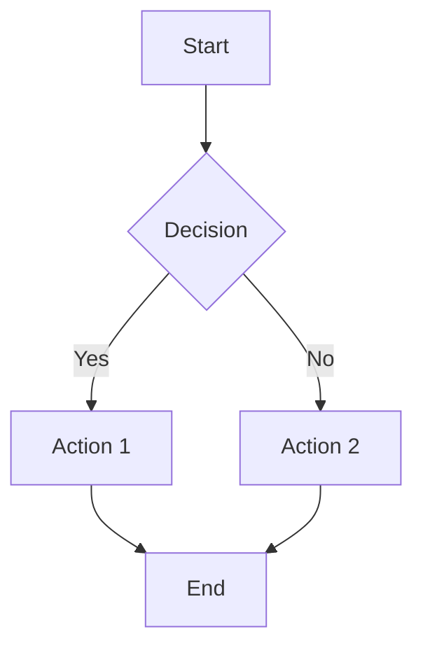

# HedgeDoc 教程：协作 Markdown 编辑器

## 简介

HedgeDoc 是一个开源的自托管协作 Markdown 编辑器。它支持实时协作写作和即时预览，非常适合文档编写、会议记录和技术写作。

## 系统要求

| 组件 | 最低配置 | 推荐配置 |
|------|---------|---------|
| Node.js | 18.0 | 20 LTS |
| 内存 | 512 MB | 2 GB |
| CPU | 1 核 | 2 核 |
| 磁盘 | 1 GB | 10 GB |
| 数据库 | SQLite | PostgreSQL |

## 安装

### Docker Compose

```yaml
version: '3.8'
services:
  hedgedoc:
    image: quay.io/hedgedoc/hedgedoc:latest
    ports:
      - "3000:3000"
    environment:
      - CMD_DB_URL=postgres://hedgedoc:hedgedoc@db:5432/hedgedoc
      - CMD_DOMAIN=localhost:3000
      - CMD_PROTOCOL_USESSL=false
      - CMD_ALLOW_ANONYMOUS=true
      - CMD_ALLOW_ANONYMOUS_EDITS=true
    depends_on:
      - db
    restart: unless-stopped

  db:
    image: postgres:15
    volumes:
      - pg-data:/var/lib/postgresql/data
    environment:
      - POSTGRES_DB=hedgedoc
      - POSTGRES_USER=hedgedoc
      - POSTGRES_PASSWORD=hedgedoc
    restart: unless-stopped

volumes:
  pg-data:
```

### 环境变量

| 变量 | 说明 | 默认值 |
|------|------|--------|
| `CMD_DB_URL` | 数据库连接字符串 | sqlite |
| `CMD_DOMAIN` | 服务器域名 | localhost:3000 |
| `CMD_PROTOCOL_USESSL` | 启用 SSL | false |
| `CMD_ALLOW_ANONYMOUS` | 允许匿名访问 | false |
| `CMD_ALLOW_ANONYMOUS_EDITS` | 匿名编辑 | false |
| `CMD_DEFAULT_PERMISSION` | 默认笔记权限 | editable |
| `CMD_SESSION_SECRET` | 会话加密密钥 | （生成） |
| `CMD_EMAIL` | 启用邮箱登录 | false |
| `CMD_ALLOW_EMAIL_REGISTER` | 允许注册 | true |

## 配置

### config.json

```json
{
  "production": {
    "domain": "notes.example.com",
    "protocolUseSSL": true,
    "allowAnonymous": true,
    "allowAnonymousEdits": true,
    "defaultPermission": "editable",
    "db": {
      "dialect": "postgres",
      "host": "db",
      "port": 5432,
      "username": "hedgedoc",
      "password": "hedgedoc",
      "database": "hedgedoc"
    }
  }
}
```

## Markdown 功能

### 标准 Markdown

| 元素 | 语法 | 结果 |
|------|------|------|
| 标题 1 | `# Title` | # Title |
| 标题 2 | `## Title` | ## Title |
| 标题 3 | `### Title` | ### Title |
| 粗体 | `**text**` | **text** |
| 斜体 | `*text*` | *text* |
| 删除线 | `~~text~~` | ~~text~~ |
| 行内代码 | `` `code` `` | `code` |
| 链接 | `[text](url)` | 可点击链接 |
| 图片 | `` | 嵌入图片 |
| 引用 | `> text` | 引用文本 |
| 水平线 | `---` | 分隔线 |

### 列表

| 类型 | 语法 |
|------|------|
| 无序 | `- item` 或 `* item` |
| 有序 | `1. item` |
| 任务 | `- [ ] task` 或 `- [x] done` |
| 嵌套 | 缩进 2 或 4 个空格 |

### 代码块

````markdown
```javascript
function hello() {
  console.log("Hello World");
}
```
````

### 表格

```markdown
| 表头 1 | 表头 2 | 表头 3 |
|--------|--------|--------|
| 单元格 1 | 单元格 2 | 单元格 3 |
| 单元格 4 | 单元格 5 | 单元格 6 |
```

## 扩展功能

### 时序图

```markdown
```sequence
Alice->Bob: Hello Bob
Bob-->Alice: Hi Alice
Alice->Bob: How are you?
Bob-->Alice: Fine thanks
```
```

### 流程图

```markdown
```flow
st=>start: Start
op=>operation: Process
cond=>condition: Decision
e=>end: End

st->op->cond
cond(yes)->e
cond(no)->op
```
```

### 数学公式（KaTeX）

```markdown
行内：$E = mc^2$

块级：
$$
\sum_{i=1}^{n} x_i = x_1 + x_2 + ... + x_n
$$
```

### Mermaid 图表

```markdown

```

### ABC 乐谱

```markdown
```abc
X:1
T:Speed the Plough
M:4/4
K:G
GABc dedB|dedB dedB|c2ec B2dB|A2FA G2z2|
```
```

## 笔记权限

| 权限 | 说明 | 谁可以访问 |
|------|------|-----------|
| 私有 | 仅所有者 | 笔记创建者 |
| 可编辑 | 有链接的人可编辑 | 所有查看者 |
| 已锁定 | 所有者可编辑，其他人查看 | 创建者编辑 |
| 可查看 | 有链接的人可查看 | 所有查看者 |
| 公开 | 在历史中列出 | 所有人 |

### 权限管理

1. 打开笔记
2. 点击 **Menu** 按钮
3. 选择 **Permissions**
4. 设置所需的权限级别
5. 可选添加特定用户

## 版本历史

### 历史功能

| 功能 | 说明 |
|------|------|
| 修订时间线 | 浏览历史版本 |
| 版本比较 | 版本间差异 |
| 恢复版本 | 回退到之前的状态 |
| 分支 | 从任意点创建分支 |

### 访问历史

1. 打开笔记
2. 点击工具栏中的 **Clock** 图标
3. 使用滑块浏览版本
4. 点击 **Restore** 回退

## 标签和分类

### 标签用法

```yaml
---
tags: [meeting, project-alpha, q1-2024]
---
```

标签允许将笔记组织成类别，并在笔记历史中启用筛选。

## 认证方式

| 方式 | 配置 | 用途 |
|------|------|------|
| 匿名 | `CMD_ALLOW_ANONYMOUS=true` | 开放访问 |
| 邮箱 | `CMD_EMAIL=true` | 基本认证 |
| LDAP | LDAP 配置 | 企业目录 |
| OAuth2 | OAuth2 配置 | SSO 集成 |
| SAML | SAML 配置 | 企业 SSO |
| GitLab | GitLab OAuth | GitLab 集成 |
| GitHub | GitHub OAuth | GitHub 集成 |

### OAuth2 配置

```bash
CMD_OAUTH2_PROVIDER_NAME=MyProvider
CMD_OAUTH2_CLIENT_ID=client-id
CMD_OAUTH2_CLIENT_SECRET=client-secret
CMD_OAUTH2_AUTHORIZATION_URL=https://auth.example.com/authorize
CMD_OAUTH2_TOKEN_URL=https://auth.example.com/token
CMD_OAUTH2_USER_PROFILE_URL=https://auth.example.com/userinfo
CMD_OAUTH2_USER_PROFILE_USERNAME_ATTR=preferred_username
CMD_OAUTH2_USER_PROFILE_DISPLAY_NAME_ATTR=name
CMD_OAUTH2_USER_PROFILE_EMAIL_ATTR=email
```

## 导入和导出

### 支持格式

| 格式 | 导入 | 导出 |
|------|------|------|
| Markdown | 是 | 是 |
| HTML | 是 | 是 |
| PDF | 否 | 是 |
| 纯文本 | 是 | 是 |

### 导出选项

1. 打开笔记
2. 点击 **Menu** 按钮
3. 选择 **Export**
4. 选择格式（Markdown、HTML、PDF）

## API

### REST API 端点

| 端点 | 方法 | 用途 |
|------|------|------|
| `/api/v1/notes` | GET | 列出笔记 |
| `/api/v1/notes/{id}` | GET | 获取笔记 |
| `/api/v1/notes/{id}` | POST | 创建/更新笔记 |
| `/api/v1/notes/{id}` | DELETE | 删除笔记 |
| `/api/v1/notes/{id}/content` | GET | 获取原始内容 |
| `/api/v1/notes/{id}/revision` | GET | 获取修订历史 |

### API 示例

```bash
# 获取笔记内容
curl http://localhost:3000/api/v1/notes/my-note/content

# 创建或更新笔记
curl -X POST http://localhost:3000/api/v1/notes/my-note \
  -H "Content-Type: text/markdown" \
  -d "# My Note\n\nContent here"
```

## 实时协作

### 协作功能

| 功能 | 说明 |
|------|------|
| 实时光标 | 查看其他用户的光标位置 |
| 用户颜色 | 每个用户唯一颜色 |
| 即时同步 | 更改立即显示 |
| 冲突解决 | 自动合并 |
| 用户计数 | 查看活跃编辑者数量 |

### WebSocket 连接

HedgeDoc 使用 WebSocket（Socket.io）进行实时同步。确保你的反向代理支持 WebSocket 升级。

## 反向代理

### Nginx 配置

```nginx
server {
    listen 80;
    server_name notes.example.com;

    location / {
        proxy_pass http://localhost:3000;
        proxy_http_version 1.1;
        proxy_set_header Upgrade $http_upgrade;
        proxy_set_header Connection "upgrade";
        proxy_set_header Host $host;
        proxy_set_header X-Real-IP $remote_addr;
        proxy_set_header X-Forwarded-For $proxy_add_x_forwarded_for;
        proxy_set_header X-Forwarded-Proto $scheme;
    }
}
```

## 备份

| 组件 | 方法 | 频率 |
|------|------|------|
| 数据库 | pg_dump | 每日 |
| 上传文件 | 文件复制 | 每日 |
| 配置 | 配置备份 | 每周 |

## 安全

| 措施 | 配置 |
|------|------|
| HTTPS | 使用 SSL 的反向代理 |
| 认证 | OAuth2 或 LDAP |
| 权限 | 笔记级访问控制 |
| 速率限制 | 基于代理的限制 |
| CSP 头 | 内容安全策略 |
| 会话密钥 | 强随机密钥 |

## 故障排除

| 问题 | 原因 | 解决方案 |
|------|------|---------|
| WebSocket 错误 | 代理未转发 | 配置 WebSocket 头 |
| 加载缓慢 | 数据库问题 | 切换到 PostgreSQL |
| 登录失败 | OAuth 配置错误 | 验证 OAuth 设置 |
| 导出失败 | 缺少依赖 | 安装所需的系统包 |
| 权限被拒绝 | 设置错误 | 检查笔记权限级别 |

## 总结

HedgeDoc 提供了一个强大的协作 Markdown 编辑平台，支持实时同步、图表支持和灵活的认证。其自托管特性和丰富的 Markdown 扩展使其适合技术文档、会议记录和协作写作。
